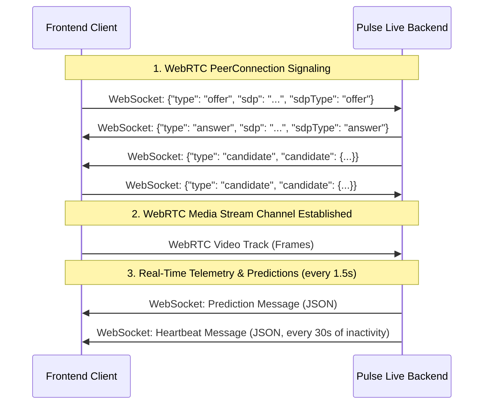

# API Contract: WebRTC & WebSocket Video Streaming and Telemetry Connections

This document defines the interface contract between the frontend and the `pulse-live` backend for real-time video streaming, facial bounding box overlay, magnitude analytics, and spotted phase analysis.

## Connection Endpoints

### 1. WebRTC Signaling and Telemetry Route
* **Protocol**: Secure WebSocket (`wss://` or `ws://`)
* **Endpoint**: `/ws/rtc/{session_id}`
* **Parameters**:
  * `session_id` (string): A unique client-assigned session identifier.

### 2. Binary Video Frame Streaming and Telemetry Route
* **Protocol**: Secure WebSocket (`wss://` or `ws://`)
* **Endpoint**: `/ws/stream/{session_id}`
* **Parameters**:
  * `session_id` (string): A unique client-assigned session identifier.
* **Message Format**:
  * **Client -> Server**: Binary messages containing raw compressed image bytes (e.g. JPEG, PNG, or WebP format). The recommended streaming rate is **15 FPS**.
  * **Server -> Client**: Text JSON messages containing `"bbox"`, `"prediction"`, `"heartbeat"`, or `"error"` types matching the telemetry schemas below.

---

## Message Flow Overview



---

## JSON Schemas & Message Specifications

All communication over the WebSocket uses JSON. The type of each message is identified by the `"type"` field.

### 1. WebRTC Signaling Messages

#### SDP Offer (Client -> Server)
Sent by the frontend to initiate the WebRTC handshaking.
```json
{
  "type": "offer",
  "sdp": "v=0\no=- 85657...",
  "sdpType": "offer"
}
```

#### SDP Answer (Server -> Client)
Sent by the backend in response to the offer.
```json
{
  "type": "answer",
  "sdp": "v=0\no=- 12948...",
  "sdpType": "answer"
}
```

#### ICE Candidate (Bidirectional)
Exchanged to establish the peer-to-peer connection candidates.
```json
{
  "type": "candidate",
  "candidate": {
    "candidate": "candidate:84216...",
    "sdpMid": "0",
    "sdpMLineIndex": 0
  }
}
```

---

### 2. Telemetry & Prediction Messages (Server -> Client)

Every **1.5 seconds**, the server runs optical flow processing and model inference on the accumulated frame window (default **15 FPS**, target **22-23 frames** per window) and returns telemetry.

#### Prediction Payload Schema (`"type": "prediction"`)
```json
{
  "type": "prediction",
  "label": "low",
  "confidence": 0.9842,
  "prob_high": 0.0158,
  "prob_low": 0.9842,
  "n_apex_detected": 1,
  "n_frames": 23,
  "warning": null,
  "top_features": [
    {
      "name": "right_eye_amplitude",
      "value": 1.4589,
      "saliency": 0.3541,
      "direction": "up"
    }
  ],
  "face_bboxes": [
    {
      "x": 0.312,
      "y": 0.201,
      "width": 0.385,
      "height": 0.452,
      "abs_x": 199,
      "abs_y": 96,
      "abs_width": 246,
      "abs_height": 216
    },
    null
  ],
  "magnitudes": [
    0.1042,
    0.1245
  ],
  "smoothed_magnitudes": [
    0.1012,
    0.1189
  ],
  "detected_phases": [
    {
      "onset": 3,
      "apex": 8,
      "offset": 12
    }
  ],
  "latency_ms": 142.58
}
```

#### Telemetry Fields Specification:

| Field Name | Type | Description |
| :--- | :--- | :--- |
| `type` | `string` | Always `"prediction"`. |
| `label` | `string` | Predicted classification label (e.g. `"low"`, `"high"`). |
| `confidence` | `float` | Prediction confidence score `[0.0, 1.0]`. |
| `n_apex_detected` | `int` | Count of detected micro-expression peaks in this window. |
| `n_frames` | `int` | Total frames analyzed in the current window. |
| `face_bboxes` | `array` | List of face bounding boxes corresponding 1-to-1 to each frame in the window. Holds `null` if no face is detected in a specific frame. |
| `face_bboxes[i].x` | `float` | Normalized X coordinate of the face bounding box top-left corner `[0.0, 1.0]`. |
| `face_bboxes[i].y` | `float` | Normalized Y coordinate of the face bounding box top-left corner `[0.0, 1.0]`. |
| `face_bboxes[i].width` | `float` | Normalized width of the face bounding box `[0.0, 1.0]`. |
| `face_bboxes[i].height` | `float` | Normalized height of the face bounding box `[0.0, 1.0]`. |
| `face_bboxes[i].abs_x` | `int` | Absolute pixel X coordinate of the top-left corner. |
| `face_bboxes[i].abs_y` | `int` | Absolute pixel Y coordinate of the top-left corner. |
| `face_bboxes[i].abs_width` | `int` | Absolute pixel width of the bounding box in pixels. |
| `face_bboxes[i].abs_height`| `int` | Absolute pixel height of the bounding box in pixels. |
| `magnitudes` | `array[float]` | Raw mean optical flow magnitudes per frame transition (length is `n_frames - 1`). |
| `smoothed_magnitudes` | `array[float]` | Savitzky-Golay smoothed magnitudes used for finding peaks (length is `n_frames - 1`). |
| `detected_phases` | `array[object]`| List of spotted micro-expression phases found in the current window. |
| `detected_phases[i].onset` | `int` | Index of the start frame (valley/onset) of the phase in the window. |
| `detected_phases[i].apex` | `int` | Index of the peak frame (apex) of the phase in the window. |
| `detected_phases[i].offset`| `int` | Index of the end frame (valley/offset) of the phase in the window. |
| `latency_ms` | `float` | Pipeline execution latency in milliseconds (e.g. `142.58`). |

---

### 3. Real-Time Face Bounding Box Messages (Server -> Client)

Sent immediately for every incoming video frame to enable sub-frame latency rendering of tracking overlays.

#### Bounding Box Payload Schema (`"type": "bbox"`)
```json
{
  "type": "bbox",
  "bbox": {
    "x": 0.312,
    "y": 0.201,
    "width": 0.385,
    "height": 0.452,
    "abs_x": 199,
    "abs_y": 96,
    "abs_width": 246,
    "abs_height": 216
  },
  "latency_ms": 22.45
}
```

If no face is detected in the current frame, `bbox` is `null`:
```json
{
  "type": "bbox",
  "bbox": null,
  "latency_ms": 21.84
}
```

---

### 4. Heartbeat Messages (Server -> Client)

Sent every **30 seconds** of inactivity to keep connection hooks alive.
```json
{
  "type": "heartbeat"
}
```

---

### 5. Error Messages (Server -> Client)

Returned when the server encounters a critical processing or connection issue.
```json
{
  "type": "error",
  "message": "Internal server error"
}
```
