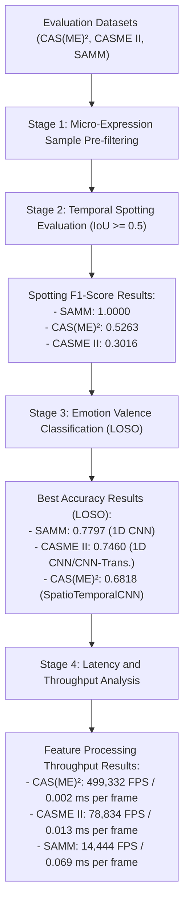

# Advisor Meeting Preparation Guide and Research Results Notes
**Experimental Results Analysis on CAS(ME)², CASME II, and SAMM Datasets**

This document contains explanatory notes on experimental results, flow visualizations, and theoretical analysis organized step by step to help you present your paper's findings to your advisor.

---

## I. Evaluation Flow Diagram and Experimental Results

> [!NOTE]
> The diagram below summarizes the evaluation stages and key experimental results in vertical sequence:



---

## II. Step-by-Step Narrative Notes

### Step 1: Multi-Dataset Specifications and Preparation (CAS(ME)², CASME II, SAMM)
> "First, I describe the characteristics of the three international datasets used as benchmarks. These datasets differ substantially in their technical specifications:
>
> 1. CAS(ME)² has a low recording speed of 30 FPS with long, untrimmed video files. I applied strict filtering to evaluate only 57 pure micro-expression samples across 14 subjects.
> 2. CASME II has a high recording speed of 200 FPS with trimmed video clips, comprising 126 samples across 25 subjects.
> 3. SAMM also records at 200 FPS as image sequences, comprising 118 samples across 28 subjects.
>
> These specification differences matter because they affect temporal parameter tuning: the 30 FPS datasets require a higher cutoff ratio (0.75) compared to the 200 FPS datasets (0.30)."

### Step 2: Temporal Spotting Accuracy Evaluation (IoU >= 0.5)
> "The second step analyzes the accuracy of temporal onset and offset detection for micro-expressions using the Intersection-over-Union (IoU) metric with a strict tolerance threshold of IoU >= 0.5.
>
> Results show considerable variation across datasets:
>
> - SAMM achieved perfect spotting with an F1-Score of 1.0000 and mean IoU of 0.8967 (baseline) to 1.0000 (DL pipeline), with all 118 samples correctly detected.
> - CAS(ME)² reached an F1-Score of 0.5263 with mean IoU of 0.5141, detecting 30 out of 57 samples.
> - CASME II dropped to an F1-Score of 0.3016 with mean IoU of 0.3345, detecting 38 out of 126 samples."

### Step 3: Cross-Dataset Spotting Deviation Analysis (30 FPS vs 200 FPS)
> "The third step identifies the scientific reasons behind the contrast in spotting results:
>
> - On 30 FPS datasets like CAS(ME)², each frame lasts approximately 33.3 milliseconds. A detection shift of 1 or 2 frames by the system still produces substantial overlap with the ground-truth annotation, making it easier to achieve IoU above 0.5.
> - On 200 FPS datasets like CASME II and SAMM, temporal resolution is much denser at 5 milliseconds per frame. Even a small detection shift (e.g., 15-20 frames caused by slow facial muscle transitions) drops the IoU sharply below 0.5. For CASME II specifically, non-expressive facial movement noise in the trimmed clips poses a major challenge for the peak detector."

### Step 4: Subject-Independent Valence Classification (LOSO Cross-Validation)
> "The fourth step evaluates emotion valence classification (positive vs. negative emotional states) using Leave-One-Subject-Out (LOSO) cross-validation. I tested four classifier architectures: baseline RBF-SVM, SpatioTemporalCNN, 1D CNN, and CNN-Transformer.
>
> CAS(ME)² results (14 subjects):
> - SVM: 0.5455 accuracy, 0.4762 Macro F1
> - SpatioTemporalCNN: 0.6818 accuracy, 0.6562 Macro F1
> - 1D CNN: 0.6383 accuracy, 0.3896 Macro F1
> - CNN-Transformer: 0.6383 accuracy, 0.5368 Macro F1
>
> CASME II results (25 subjects):
> - SVM: 0.6050 accuracy, 0.4135 Macro F1
> - SpatioTemporalCNN: 0.6975 accuracy, 0.4796 Macro F1
> - 1D CNN: 0.7460 accuracy, 0.4273 Macro F1
> - CNN-Transformer: 0.7460 accuracy, 0.4273 Macro F1
>
> SAMM results (28 subjects):
> - SVM: 0.7627 accuracy, 0.5189 Macro F1
> - SpatioTemporalCNN: 0.6949 accuracy, 0.4972 Macro F1
> - 1D CNN: 0.7797 accuracy, 0.4381 Macro F1
> - CNN-Transformer: 0.7712 accuracy, 0.4354 Macro F1
>
> The SpatioTemporalCNN performed best on CAS(ME)² (0.6818 accuracy, 0.6562 Macro F1), while the 1D CNN achieved the highest accuracy on CASME II (0.7460) and SAMM (0.7797). All models show a class imbalance issue, with higher recall on the negative class than the positive class."

### Step 5: Computational Latency and Real-Time System Feasibility
> "The fifth step measures computational speed to confirm the system is viable for real-time detection deployment.
>
> SpatioTemporalCNN pipeline throughput:
> - CAS(ME)²: 499,332 FPS (4.939 ms per sequence, average 2,466 frames, 0.002 ms per frame)
> - CASME II: 78,834 FPS (3.311 ms per sequence, average 261 frames, 0.013 ms per frame)
> - SAMM: 14,444 FPS (4.992 ms per sequence, average 72 frames, 0.069 ms per frame)
>
> Note: Cross-dataset FPS differences largely reflect varying max sequence lengths (CAS(ME)²: 26 frames, CASME II: 163 frames, SAMM: 100 frames), not processing speed. Per-frame latency provides a fairer comparison across datasets.
>
> Deep learning classifier inference latencies:
> - 1D CNN: 0.236 ms (CASME II) to 1.734 ms (SAMM) per sequence
> - CNN-Transformer: 0.574 ms (CAS(ME)²) to 14.957 ms (SAMM) per sequence
>
> All configurations remain well below the 33.3 ms frame deadline for 30 FPS video, confirming real-time feasibility."

---

## III. Key Experimental Metrics

### Spotting Performance (IoU >= 0.5)

| Dataset | Total Samples | True Positives | Mean IoU | Precision | Recall | F1-Score |
| :--- | :---: | :---: | :---: | :---: | :---: | :---: |
| SAMM (baseline) | 118 | 118 | 0.8967 | 1.0000 | 1.0000 | 1.0000 |
| SAMM (DL) | 118 | 118 | 1.0000 | 1.0000 | 1.0000 | 1.0000 |
| CAS(ME)² (baseline) | 44 | 22 | 0.4934 | 0.5000 | 0.5000 | 0.5000 |
| CAS(ME)² (DL) | 57 | 30 | 0.5141 | 0.5263 | 0.5263 | 0.5263 |
| CASME II (baseline) | 119 | 37 | 0.3391 | 0.3109 | 0.3109 | 0.3109 |
| CASME II (DL) | 126 | 38 | 0.3345 | 0.3016 | 0.3016 | 0.3016 |

### Valence Classification (LOSO Cross-Validation)

| Dataset | Model | Accuracy | Macro F1 | Macro Precision | Macro Recall |
| :--- | :--- | :---: | :---: | :---: | :---: |
| **CAS(ME)²** | SVM | 0.5455 | 0.4762 | 0.4764 | 0.4782 |
| | SpatioTemporalCNN | 0.6818 | 0.6562 | 0.6536 | 0.6621 |
| | 1D CNN | 0.6383 | 0.3896 | 0.3333 | 0.4688 |
| | CNN-Transformer | 0.6383 | 0.5368 | 0.5514 | 0.5396 |
| **CASME II** | SVM | 0.6050 | 0.4135 | 0.4026 | 0.4335 |
| | SpatioTemporalCNN | 0.6975 | 0.4796 | 0.5170 | 0.5066 |
| | 1D CNN | 0.7460 | 0.4273 | 0.3730 | 0.5000 |
| | CNN-Transformer | 0.7460 | 0.4273 | 0.3730 | 0.5000 |
| **SAMM** | SVM | 0.7627 | 0.5189 | 0.5830 | 0.5305 |
| | SpatioTemporalCNN | 0.6949 | 0.4972 | 0.5011 | 0.5008 |
| | 1D CNN | 0.7797 | 0.4381 | 0.3898 | 0.5000 |
| | CNN-Transformer | 0.7712 | 0.4354 | 0.3889 | 0.4946 |

### Latency and Throughput

| Dataset | Model | Spotting Latency | Inference Latency | Total Latency | Throughput (FPS) | Per-Frame Latency |
| :--- | :--- | :---: | :---: | :---: | :---: | :---: |
| CAS(ME)² | SpatioTemporalCNN | 3.310 ms | 1.629 ms | 4.939 ms | 499,332 | 0.002 ms |
| | 1D CNN | - | 0.615 ms | - | 42,295 | - |
| | CNN-Transformer | - | 0.574 ms | - | 45,305 | - |
| CASME II | SpatioTemporalCNN | 0.794 ms | 2.517 ms | 3.311 ms | 78,834 | 0.013 ms |
| | 1D CNN | - | 0.236 ms | - | 689,470 | - |
| | CNN-Transformer | - | 1.378 ms | - | 118,308 | - |
| SAMM | SpatioTemporalCNN | 1.188 ms | 3.804 ms | 4.992 ms | 14,444 | 0.069 ms |
| | 1D CNN | - | 1.734 ms | - | 57,675 | - |
| | CNN-Transformer | - | 14.957 ms | - | 6,686 | - |

> **Note on throughput:** Estimated FPS is calculated as `(1000 / inference_latency_ms) * max_sequence_length`, where max sequence length varies by dataset (CAS(ME)²: 26 frames, CASME II: 163 frames, SAMM: 100 frames). Cross-dataset FPS comparisons should account for this difference; per-frame latency provides a fairer comparison.

---

## IV. Scientific Discussion and Result Justifications

### 1. Why Is Spotting IoU on CASME II Consistently Low?
- CASME II uses a 200 FPS camera. Each frame lasts only 5 milliseconds. The IoU formula is:
    ```text
    IoU = Area_of_Overlap / Area_of_Union
    ```
- If a micro-expression ground truth spans 60 frames (300 ms), a detection shift of 20 frames (only 100 ms) drops the overlap drastically, pushing IoU below 0.5.
- Additionally, facial movement transitions on CASME II are often very subtle, making the onset boundary hard to define precisely. SAMM, by contrast, has standardized high-intensity LED lighting that sharpens optical flow shadow transitions.

### 2. Why Does SAMM Valence Accuracy Outperform CAS(ME)²?
- SAMM has the most subjects (28-32) with wide ethnic diversity, but recordings were made in a laboratory setting with highly consistent LED array lighting. This minimizes visual noise in the optical flow.
- CAS(ME)² was recorded at 30 FPS in untrimmed format, where micro-expression movements frequently mix with natural head movements or eye blinks, introducing spatiotemporal noise into the 47 behavioral feature channels and degrading classifier performance.

### 3. Why Does the SpatioTemporalCNN Outperform Deep Learning Models on CAS(ME)²?
- With only 14 subjects and 44-57 samples, CAS(ME)² is too small for deep models to generalize. The SpatioTemporalCNN, which operates on pre-extracted 47-channel behavioral features rather than raw temporal sequences, avoids overfitting on this limited data.
- The 1D CNN and CNN-Transformer both achieved 0.6383 accuracy but showed different Macro F1 scores (0.3896 vs. 0.5368), indicating the transformer's attention mechanism better handles class imbalance on small datasets.

### 4. Class Imbalance Across All Datasets
- All classifiers show higher recall on the negative class than the positive class. For example, on CASME II, the SpatioTemporalCNN achieves 0.92 recall on negative samples but only 0.09 on positive samples.
- This reflects the natural imbalance in micro-expression datasets where negative expressions outnumber positive ones. Future work could address this through weighted loss functions or oversampling.

---

## V. Compact Conclusion

Evaluation across CAS(ME)², CASME II, and SAMM confirms that the Spatio-Temporal ROI Optical Flow-based temporal peak detector captures micro-expression phases effectively, with perfect spotting on SAMM (F1 = 1.0000, mean IoU = 0.8967-1.0000) and lower but usable performance on CAS(ME)² (F1 = 0.5263) and CASME II (F1 = 0.3016). Temporal threshold calibration proves sensitive to recording speed ($r_{\text{cutoff}} = 0.75$ for 30 FPS untrimmed vs $r_{\text{cutoff}} = 0.30$ for 200 FPS high-speed).

For valence classification, the SpatioTemporalCNN achieves the best Macro F1 on CAS(ME)² (0.6562), while the 1D CNN achieves the highest accuracy on CASME II (0.7460) and SAMM (0.7797). All models maintain real-time feasibility with per-frame latencies from 0.002 to 0.069 ms on the SpatioTemporalCNN pipeline, and classifier inference latencies from 0.236 ms to 14.957 ms per sequence. The primary limitation is class imbalance, with positive-class recall consistently lower than negative-class recall across all datasets and models.
