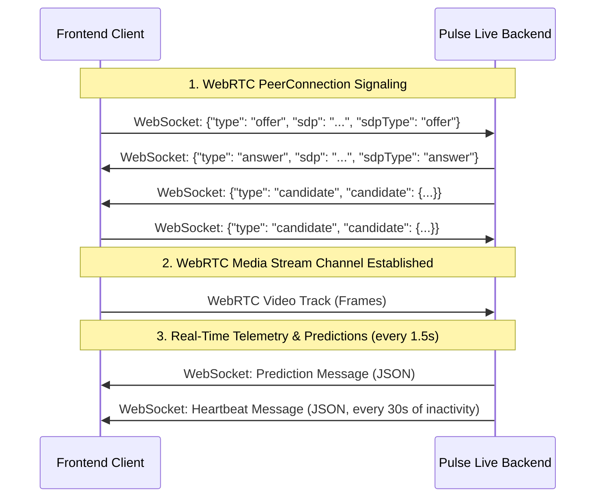
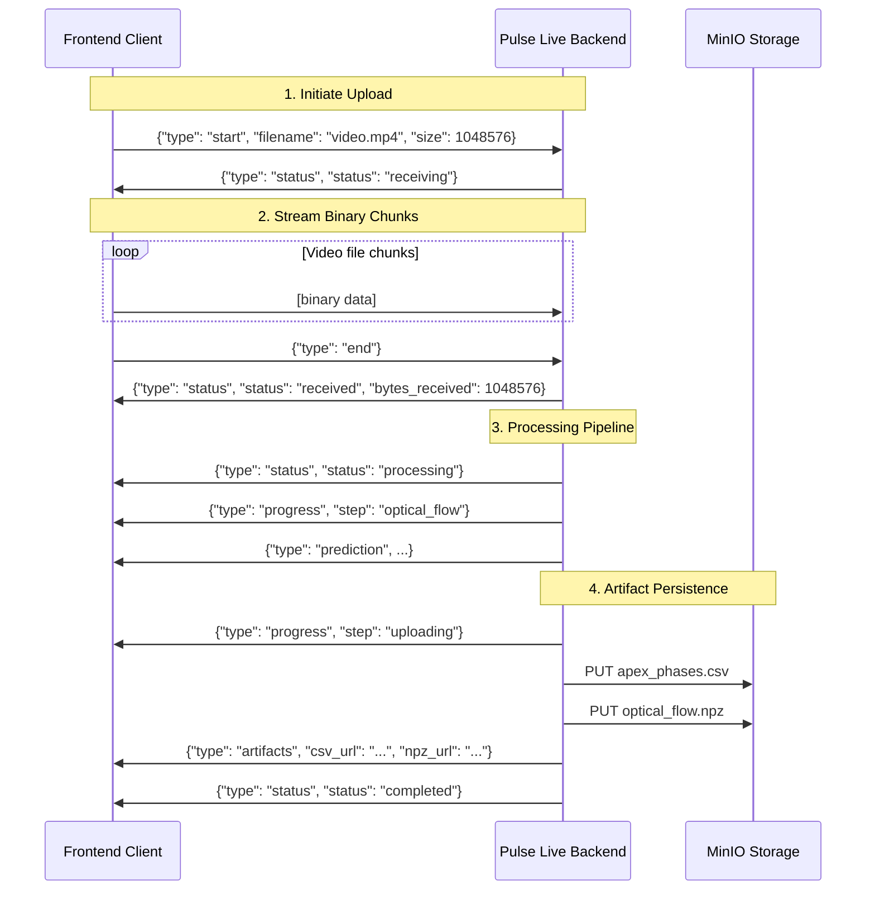

# API Contract: WebRTC & WebSocket Video Streaming and Telemetry Connections

This document defines the interface contract between the frontend and the `pulse-live` backend for real-time video streaming, facial bounding box overlay, magnitude analytics, and spotted phase analysis.

## Connection Endpoints

### 1. WebRTC Signaling and Telemetry Route
* **Protocol**: Secure WebSocket (`wss://` or `ws://`)
* **Endpoint**: `/ws/rtc/{session_id}`
* **Parameters**:
  * `session_id` (string): A unique client-assigned session identifier.

### 2. Binary Video Frame Streaming and Telemetry Route
* **Protocol**: Secure WebSocket (`wss://` or `ws://`)
* **Endpoint**: `/ws/stream/{session_id}`
* **Parameters**:
  * `session_id` (string): A unique client-assigned session identifier.
* **Message Format**:
  * **Client -> Server**: Binary messages containing raw compressed image bytes (e.g. JPEG, PNG, or WebP format). The recommended streaming rate is **15 FPS**.
  * **Server -> Client**: Text JSON messages containing `"bbox"`, `"prediction"`, `"heartbeat"`, or `"error"` types matching the telemetry schemas below.

---

## Message Flow Overview



---

## JSON Schemas & Message Specifications

All communication over the WebSocket uses JSON. The type of each message is identified by the `"type"` field.

### 1. WebRTC Signaling Messages

#### SDP Offer (Client -> Server)
Sent by the frontend to initiate the WebRTC handshaking.
```json
{
  "type": "offer",
  "sdp": "v=0\no=- 85657...",
  "sdpType": "offer"
}
```

#### SDP Answer (Server -> Client)
Sent by the backend in response to the offer.
```json
{
  "type": "answer",
  "sdp": "v=0\no=- 12948...",
  "sdpType": "answer"
}
```

#### ICE Candidate (Bidirectional)
Exchanged to establish the peer-to-peer connection candidates.
```json
{
  "type": "candidate",
  "candidate": {
    "candidate": "candidate:84216...",
    "sdpMid": "0",
    "sdpMLineIndex": 0
  }
}
```

---

### 2. Telemetry & Prediction Messages (Server -> Client)

Every **1.5 seconds**, the server runs optical flow processing and model inference on the accumulated frame window (default **15 FPS**, target **22-23 frames** per window) and returns telemetry.

#### Prediction Payload Schema (`"type": "prediction"`)
```json
{
  "type": "prediction",
  "label": "low",
  "confidence": 0.9842,
  "prob_high": 0.0158,
  "prob_low": 0.9842,
  "n_apex_detected": 1,
  "n_frames": 23,
  "warning": null,
  "top_features": [
    {
      "name": "right_eye_amplitude",
      "value": 1.4589,
      "saliency": 0.3541,
      "direction": "up"
    }
  ],
  "face_bboxes": [
    {
      "x": 0.312,
      "y": 0.201,
      "width": 0.385,
      "height": 0.452,
      "abs_x": 199,
      "abs_y": 96,
      "abs_width": 246,
      "abs_height": 216
    },
    null
  ],
  "magnitudes": [
    0.1042,
    0.1245
  ],
  "smoothed_magnitudes": [
    0.1012,
    0.1189
  ],
  "detected_phases": [
    {
      "onset": 3,
      "apex": 8,
      "offset": 12
    }
  ],
  "latency_ms": 142.58
}
```

#### Telemetry Fields Specification:

| Field Name | Type | Description |
| :--- | :--- | :--- |
| `type` | `string` | Always `"prediction"`. |
| `label` | `string` | Predicted classification label (e.g. `"low"`, `"high"`). |
| `confidence` | `float` | Prediction confidence score `[0.0, 1.0]`. |
| `n_apex_detected` | `int` | Count of detected micro-expression peaks in this window. |
| `n_frames` | `int` | Total frames analyzed in the current window. |
| `face_bboxes` | `array` | List of face bounding boxes corresponding 1-to-1 to each frame in the window. Holds `null` if no face is detected in a specific frame. |
| `face_bboxes[i].x` | `float` | Normalized X coordinate of the face bounding box top-left corner `[0.0, 1.0]`. |
| `face_bboxes[i].y` | `float` | Normalized Y coordinate of the face bounding box top-left corner `[0.0, 1.0]`. |
| `face_bboxes[i].width` | `float` | Normalized width of the face bounding box `[0.0, 1.0]`. |
| `face_bboxes[i].height` | `float` | Normalized height of the face bounding box `[0.0, 1.0]`. |
| `face_bboxes[i].abs_x` | `int` | Absolute pixel X coordinate of the top-left corner. |
| `face_bboxes[i].abs_y` | `int` | Absolute pixel Y coordinate of the top-left corner. |
| `face_bboxes[i].abs_width` | `int` | Absolute pixel width of the bounding box in pixels. |
| `face_bboxes[i].abs_height`| `int` | Absolute pixel height of the bounding box in pixels. |
| `magnitudes` | `array[float]` | Raw mean optical flow magnitudes per frame transition (length is `n_frames - 1`). |
| `smoothed_magnitudes` | `array[float]` | Savitzky-Golay smoothed magnitudes used for finding peaks (length is `n_frames - 1`). |
| `detected_phases` | `array[object]`| List of spotted micro-expression phases found in the current window. |
| `detected_phases[i].onset` | `int` | Index of the start frame (valley/onset) of the phase in the window. |
| `detected_phases[i].apex` | `int` | Index of the peak frame (apex) of the phase in the window. |
| `detected_phases[i].offset`| `int` | Index of the end frame (valley/offset) of the phase in the window. |
| `latency_ms` | `float` | Pipeline execution latency in milliseconds (e.g. `142.58`). |

---

### 3. Real-Time Face Bounding Box Messages (Server -> Client)

Sent immediately for every incoming video frame to enable sub-frame latency rendering of tracking overlays.

#### Bounding Box Payload Schema (`"type": "bbox"`)
```json
{
  "type": "bbox",
  "bbox": {
    "x": 0.312,
    "y": 0.201,
    "width": 0.385,
    "height": 0.452,
    "abs_x": 199,
    "abs_y": 96,
    "abs_width": 246,
    "abs_height": 216
  },
  "latency_ms": 22.45
}
```

If no face is detected in the current frame, `bbox` is `null`:
```json
{
  "type": "bbox",
  "bbox": null,
  "latency_ms": 21.84
}
```

---

### 4. Alert Messages (Server -> Client)

Sent when specific conditions are met during inference. Currently used to notify when `anxiety_tinggi` is detected.
```json
{
  "type": "alert",
  "alert_type": "anxiety_tinggi",
  "message": "Terdeteksi Tingkat Kecemasan Tinggi"
}
```

---

### 5. Heartbeat Messages (Server -> Client)

Sent every **30 seconds** of inactivity to keep connection hooks alive.
```json
{
  "type": "heartbeat"
}
```

---

### 6. Error Messages (Server -> Client)

Returned when the server encounters a critical processing or connection issue.
```json
{
  "type": "error",
  "message": "Internal server error"
}
```

---

## Video File Processing Endpoint

### 3. Video Upload and Batch Processing Route
* **Protocol**: WebSocket (`wss://` or `ws://`)
* **Endpoint**: `/ws/video/{session_id}`
* **Parameters**:
  * `session_id` (string): A unique client-assigned session identifier.
* **Purpose**: Upload a complete video file, run the full inference pipeline (same as WebRTC), and persist apex phase CSV and optical flow NPZ artifacts to MinIO object storage.

---

### Video Processing Message Flow



---

### Video Processing Messages (Client -> Server)

#### Start Upload
Sent first to declare the incoming video file.
```json
{
  "type": "start",
  "filename": "interview_clip.mp4",
  "size": 1048576
}
```

| Field | Type | Description |
| :--- | :--- | :--- |
| `type` | `string` | Always `"start"`. |
| `filename` | `string` | Original filename (used for extension detection). |
| `size` | `int` | Expected file size in bytes (informational). |

#### Binary Data Chunks
After the `"start"` message, the client streams raw binary WebSocket frames containing the video file content. Chunk size is client-determined (recommended: 64 KB–1 MB).

#### End Upload
Sent after all binary chunks to signal upload completion.
```json
{
  "type": "end"
}
```

---

### Video Processing Messages (Server -> Client)

#### Status Messages (`"type": "status"`)
```json
{
  "type": "status",
  "status": "receiving | received | processing | completed",
  "message": "Human-readable status description.",
  "bytes_received": 1048576
}
```

| Field | Type | Description |
| :--- | :--- | :--- |
| `status` | `string` | One of `"receiving"`, `"received"`, `"processing"`, `"completed"`. |
| `message` | `string` | Human-readable description. |
| `bytes_received` | `int` | *(Only on `"received"`)* Total bytes received. |

#### Progress Messages (`"type": "progress"`)
```json
{
  "type": "progress",
  "step": "optical_flow | uploading",
  "message": "Optical flow extracted. 150 frames, 3 apex detected.",
  "n_frames": 150,
  "n_apex": 3
}
```

| Field | Type | Description |
| :--- | :--- | :--- |
| `step` | `string` | Pipeline stage: `"optical_flow"` or `"uploading"`. |
| `message` | `string` | Human-readable progress description. |
| `n_frames` | `int` | *(Only on `"optical_flow"`)* Total frames processed. |
| `n_apex` | `int` | *(Only on `"optical_flow"`)* Number of apex peaks detected. |

#### Prediction Message (`"type": "prediction"`)
Same schema as the real-time prediction (Section 2), but without `face_bboxes` or `latency_ms`.
For this endpoint, `magnitudes` contains the **smoothed** signal used for phase spotting, and `raw_magnitudes` contains the unsmoothed signal:
```json
{
  "type": "prediction",
  "label": "high",
  "confidence": 0.8721,
  "prob_high": 0.8721,
  "prob_low": 0.1279,
  "n_apex_detected": 3,
  "n_frames": 150,
  "warning": null,
  "top_features": [
    {
      "name": "apex1_lips_mean_mag",
      "value": 2.3401,
      "saliency": 0.5123,
      "direction": "high"
    }
  ],
  "magnitudes": [0.1012, 0.1189, 0.0971],
  "raw_magnitudes": [0.1042, 0.1245, 0.0983],
  "detected_phases": [
    {"onset": 12, "apex": 28, "offset": 41}
  ],
  "inference_diagnostics": {
    "strict_notebook_parity": true,
    "spotter_detect_interval": 1,
    "spotter_tvl1_fast_mode": false,
    "flow_shape": [149, 5, 2, 64, 64],
    "inferencer_loaded": true,
    "threshold": 0.625,
    "n_tta": 8,
    "detector_percentile": 95.0,
    "detector_prominence": 0.5,
    "phases": ["onset", "apex"],
    "max_seq_len": 512,
    "checkpoint_path": "combinations-notebooks/checkpoints_0407-onset-apex-behavior-cnn-transformer/best_model.pt"
  }
}
```

#### Artifact URLs (`"type": "artifacts"`)
Returned after successful upload of inference artifacts to MinIO.
```json
{
  "type": "artifacts",
  "csv_url": "http://localhost:9000/pulse-live/sessions/.../apex_phases.csv?...",
  "npz_url": "http://localhost:9000/pulse-live/sessions/.../optical_flow.npz?...",
  "csv_key": "sessions/{session_id}/{timestamp}/apex_phases.csv",
  "npz_key": "sessions/{session_id}/{timestamp}/optical_flow.npz"
}
```

| Field | Type | Description |
| :--- | :--- | :--- |
| `csv_url` | `string` | Pre-signed download URL for the apex phases CSV (expires in 1 hour). |
| `npz_url` | `string` | Pre-signed download URL for the optical flow NPZ (expires in 1 hour). |
| `csv_key` | `string` | MinIO object key for the CSV file. |
| `npz_key` | `string` | MinIO object key for the NPZ file. |

#### MinIO Storage Structure
```
pulse-live/                              ← bucket
└── sessions/
    └── {session_id}/
        └── {YYYYMMDD_HHMMSS}/
            ├── apex_phases.csv          ← onset/apex/offset indices + magnitudes
            └── optical_flow.npz         ← compressed raw flow vectors (dx/dy only)
```

#### Optical Flow NPZ Content

| Key | Type | Description |
| :--- | :--- | :--- |
| `dx` | `float16[T, H, W]` | Raw horizontal optical-flow component per frame pair (compact storage). |
| `dy` | `float16[T, H, W]` | Raw vertical optical-flow component per frame pair (compact storage). |

#### Apex Phases CSV Columns

| Column | Type | Description |
| :--- | :--- | :--- |
| `session_id` | `string` | Session identifier. |
| `phase_idx` | `int` | Zero-based phase index. |
| `onset` | `int` | Frame index of phase onset. |
| `apex` | `int` | Frame index of phase apex (peak). |
| `offset` | `int` | Frame index of phase offset. |
| `onset_mag` | `float` | Optical flow magnitude at onset frame. |
| `apex_mag` | `float` | Optical flow magnitude at apex frame. |
| `offset_mag` | `float` | Optical flow magnitude at offset frame. |

---

## Detection History Endpoints

### 1. List All Detection Sessions
* **Protocol**: HTTP GET
* **Endpoint**: `/history`
* **Purpose**: Retrieves a list of all recorded sessions and the total number of detections in each.

#### Response Schema
```json
{
  "sessions": [
    {
      "session_id": "123e4567-e89b-12d3-a456-426614174000",
      "total_detections": 2
    }
  ]
}
```

### 2. Get Session Detections
* **Protocol**: HTTP GET
* **Endpoint**: `/history/{session_id}`
* **Parameters**:
  * `session_id` (string): The identifier of the session.
* **Purpose**: Retrieves a list of all detection IDs recorded under the specified session.

#### Response Schema
```json
{
  "detections": [
    "a1b2c3d4e5f6",
    "8f7e6d5c4b3a"
  ]
}
```

### 3. Get Detection Summary Detail
* **Protocol**: HTTP GET
* **Endpoint**: `/history/{session_id}/{detection_id}/summary`
* **Parameters**:
  * `session_id` (string): The identifier of the session.
  * `detection_id` (string): The identifier of the specific detection run.
* **Purpose**: Fetches the exact JSON telemetry output that was generated and archived at the time of the inference run. 

#### Response Schema
The response is the complete prediction telemetry JSON (matching the schema in **Section 2: Telemetry & Prediction Messages** above).

```json
{
  "type": "prediction",
  "label": "low",
  "confidence": 0.9842,
  "detection_id": "a1b2c3d4e5f6",
  "n_windows": 1,
  "n_frames": 23,
  "face_bboxes": [...],
  "magnitudes": [...],
  "smoothed_magnitudes": [...],
  "detected_phases": [...],
  "latency_ms": 142.58
}
```

### 4. Get Session Detections Batch
* **Protocol**: HTTP GET
* **Endpoint**: `/history/{session_id}/batch`
* **Parameters**:
  * `session_id` (string): The identifier of the session.
* **Purpose**: Fetches all detection summaries for a specific session in a single batch request, avoiding the need for multiple API calls.

#### Response Schema
```json
{
  "detections": [
    {
      "type": "prediction",
      "label": "low",
      "confidence": 0.9842,
      "detection_id": "a1b2c3d4e5f6",
      ...
    },
    {
      "type": "prediction",
      "label": "high",
      "confidence": 0.8123,
      "detection_id": "8f7e6d5c4b3a",
      ...
    }
  ]
}
```

### 5. Get Session Latencies Recap
* **Protocol**: HTTP GET
* **Endpoint**: `/history/{session_id}/latencies`
* **Parameters**:
  * `session_id` (string): The identifier of the session.
* **Purpose**: Retrieves a summarized recap of all pipeline latencies per detection phase for a specific session.

#### Response Schema
```json
{
  "latencies": [
    {
      "detection_id": "a1b2c3d4e5f6",
      "webrtc_latency_avg_ms": 12.5,
      "landmark_latency_avg_ms": 35.2,
      "flow_latency_avg_ms": 40.1,
      "spotting_latency_ms": 5.4,
      "model_inference_latency_ms": 48.3,
      "total_latency_ms": 142.58
    }
  ]
}
```

### 6. Get Global Latencies Summary
* **Protocol**: HTTP GET
* **Endpoint**: `/history/latencies/summary`
* **Purpose**: Retrieves a global aggregation and average of all latencies across every detection and every session ever recorded.

#### Response Schema
```json
{
  "total_detections_analyzed": 1542,
  "global_averages": {
    "average_fps": 14.67,
    "webrtc_latency_avg_ms": 11.2,
    "landmark_latency_avg_ms": 34.8,
    "flow_latency_avg_ms": 39.5,
    "spotting_latency_ms": 5.1,
    "model_inference_latency_ms": 47.9,
    "total_latency_ms": 138.5
  }
}
```
