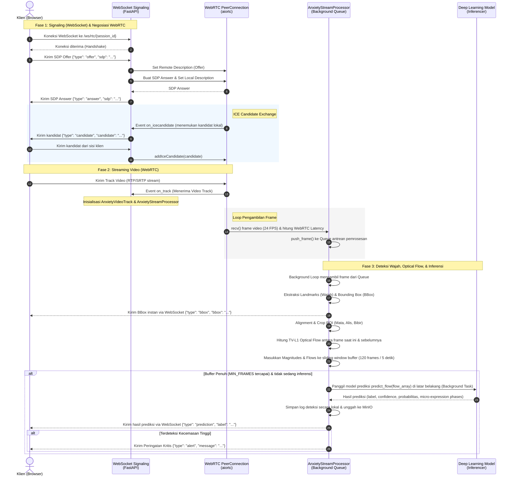

# Workflow WebRTC & WebSocket di Repositori Pulse-Live

Dokumen ini menjelaskan alur kerja (*workflow*) streaming video berbasis **WebRTC** dan pengiriman data melalui **WebSocket** pada proyek `pulse-live` untuk deteksi tingkat kecemasan (*anxiety detection*). Penjelasan dibagi menjadi tiga bagian utama: **Diagram Alur**, **Konsep Arsitektur**, dan **Implementasi Baris Kode**.

---

## I. DIAGRAM ALUR SISTEM (MERMAID DIAGRAM)

Bagan alur di bawah ini merangkum proses komputasi yang berjalan secara vertikal linier, mulai dari signaling hingga inferensi model:



---

## II. PENJELASAN KONSEP ARSITEKTUR

Sistem ini didesain untuk mendeteksi kecemasan (*anxiety*) secara *real-time* dari wajah pengguna dengan latensi seminimal mungkin. Untuk mencapai itu, repositori ini mengombinasikan dua metode komunikasi:

### 1. WebRTC & WebSocket Signaling (`/ws/rtc/{session_id}`)
* **Konsep**: WebRTC (*Web Real-Time Communication*) adalah protokol terbaik untuk transmisi video/audio berlatensi rendah secara langsung (*peer-to-peer*). Namun, sebelum dua perangkat dapat bertukar data media, mereka memerlukan saluran komunikasi luar untuk saling mengenali. Proses pertukaran informasi metadata koneksi ini disebut **Signaling**.
* **Fungsi WebSocket**: Di sini, WebSocket digunakan sebagai mediator *signaling* untuk menukar:
  1. **SDP (Session Description Protocol) Offer & Answer**: Informasi format video, codec, dan konfigurasi media.
  2. **ICE (Interactive Connectivity Establishment) Candidates**: Informasi rute jaringan terbaik (IP/Port) agar data media dapat mengalir.
* **Fungsi WebRTC**: Setelah koneksi WebRTC terbentuk, data video dikirim langsung melalui protokol RTP/SRTP (UDP), yang jauh lebih cepat daripada HTTP atau WebSocket TCP biasa karena tidak memblokir antrean jika terjadi kehilangan paket (*non-blocking*).

### 2. Streaming Frame Mentah via WebSocket (`/ws/stream/{session_id}`)
* **Konsep**: Sebagai jalur cadangan (*fallback*), sistem menyediakan alternatif pengiriman video. Klien tidak perlu menegosiasikan WebRTC, melainkan langsung mengirimkan frame gambar mentah (binary JPG/PNG) secara terus-menerus melalui koneksi WebSocket.
* **Kelebihan/Kekurangan**: Lebih mudah diimplementasikan di sisi klien, tetapi memiliki latensi dan overhead TCP yang lebih tinggi dibandingkan WebRTC.

### 3. Pemrosesan Non-blocking (Queue-based & Thread Executor)
Pemrosesan computer vision (seperti pendeteksian wajah MediaPipe dan kalkulasi Optical Flow TV-L1) merupakan operasi yang memakan memori dan CPU (*CPU-bound*). Jika dijalankan langsung di event loop utama ASGI (FastAPI), server akan membeku (*freeze*).
* **Solusinya**: 
  1. Server menggunakan antrean asinkron (`asyncio.Queue`) dengan batas kapasitas maksimal agar frame yang menumpuk dibuang jika pemrosesan terlalu lambat (*backpressure management*).
  2. Fungsi pendeteksian wajah, kalkulasi optical flow, dan inferensi model dijalankan di dalam **Thread Pool Executor** menggunakan `loop.run_in_executor(None, ...)`, membiarkan thread asinkron utama FastAPI tetap responsif melayani koneksi klien lain.

---

## III. IMPLEMENTASI BARIS KODE

Berikut adalah rincian kode yang mengimplementasikan konsep-konsep di atas, merujuk langsung ke file [src/api/webrtc.py](file:///home/inadio/skripkir/pulse-live/src/api/webrtc.py) dan [src/api/websocket.py](file:///home/inadio/skripkir/pulse-live/src/api/websocket.py).

### 1. Alur Signaling WebRTC (SDP & ICE)
Semua negosiasi koneksi WebRTC ditangani di dalam endpoint `/ws/rtc/{session_id}` pada file [src/api/webrtc.py](file:///home/inadio/skripkir/pulse-live/src/api/webrtc.py#L586):

```python
# file:///home/inadio/skripkir/pulse-live/src/api/webrtc.py#L586-L591
@router.websocket("/ws/rtc/{session_id}")
async def webrtc_signaling(websocket: WebSocket, session_id: str) -> None:
    await websocket.accept()
    logger.info("Session %s connected", session_id)

    state = _SessionState(pc=RTCPeerConnection())
```
* **Penjelasan**: Saat klien tersambung ke URL ini, server menyetujui koneksi WebSocket dan langsung menginisiasi objek `RTCPeerConnection` dari pustaka `aiortc` untuk mengelola koneksi WebRTC.

#### A. Menangani SDP Offer & Answer
```python
# file:///home/inadio/skripkir/pulse-live/src/api/webrtc.py#L640-L657
            if msg_type == "offer":
                offer = RTCSessionDescription(
                    sdp=str(msg["sdp"]),
                    type=str(msg["sdpType"]),
                )
                await state.pc.setRemoteDescription(offer)
                answer = await state.pc.createAnswer()
                await state.pc.setLocalDescription(answer)

                raw = json.dumps(
                    {
                        "type": "answer",
                        "sdp": state.pc.localDescription.sdp,
                        "sdpType": state.pc.localDescription.type,
                    }
                )
                logger.info("Sending SDP answer to session %s: %s", session_id, raw)
                await websocket.send_text(raw)
```
* **Penjelasan**: Ketika menerima pesan `"offer"` dari klien:
  1. Server memformat SDP tersebut menjadi objek `RTCSessionDescription` dan memasukkannya ke konfigurasi peer connection remote (`setRemoteDescription`).
  2. Server membuat SDP `"answer"` lokal (`createAnswer`), mendaftarkannya sebagai local description (`setLocalDescription`), lalu mengirimkannya kembali ke klien melalui WebSocket agar disetujui di sisi klien.

#### B. Pertukaran ICE Candidates
```python
# file:///home/inadio/skripkir/pulse-live/src/api/webrtc.py#L601-L615
    @state.pc.on("icecandidate")
    async def _on_icecandidate(candidate: object) -> None:
        if candidate is not None:
            raw = json.dumps(
                {
                    "type": "candidate",
                    "candidate": {
                        "candidate": candidate.to_sdp(),
                        "sdpMid": candidate.sdpMid,
                        "sdpMLineIndex": candidate.sdpMLineIndex,
                    },
                }
            )
            logger.info("Sending ICE candidate to session %s: %s", session_id, raw)
            await websocket.send_text(raw)
```
* **Penjelasan**: Listener `@state.pc.on("icecandidate")` mendeteksi ketika tumpukan WebRTC lokal menemukan jalur jaringan baru (kandidat ICE), yang kemudian secara otomatis diteruskan ke klien melalui WebSocket. Sebaliknya, ketika klien mengirimkan kandidat ICE-nya ke server (tipe pesan `"candidate"`), server memprosesnya dan menambahkannya ke peer connection (`addIceCandidate`) (baris [L659-L686](file:///home/inadio/skripkir/pulse-live/src/api/webrtc.py#L659-L686)).

---

### 2. Penerimaan Track Video & Pemrosesan Frame
Setelah SDP dinegosiasikan, koneksi WebRTC aktif dan event `"track"` akan dipicu untuk menerima aliran video:

```python
# file:///home/inadio/skripkir/pulse-live/src/api/webrtc.py#L617-L629
    @state.pc.on("track")
    def _on_track(track: MediaStreamTrack) -> None:
        if track.kind == "video":
            if state.consume_task is not None:
                state.consume_task.cancel()
            if state.video_track is not None:
                state.video_track.stop()

            local_track = AnxietyVideoTrack(track, state.result_queue, session_id=session_id)

            state.video_track = local_track
            state.consume_task = asyncio.create_task(_consume_track(local_track))
            logger.info("Video track received for session %s", session_id)
```
* **Penjelasan**: Jika track yang diterima berjenis `"video"`, server membungkusnya ke dalam objek kelas kustom `AnxietyVideoTrack` dan menjalankan task asinkron `_consume_track(local_track)` di latar belakang untuk menarik data gambar secara berulang.

#### A. Kelas `AnxietyVideoTrack` (Penarikan Frame Video)
```python
# file:///home/inadio/skripkir/pulse-live/src/api/webrtc.py#L506-L523
    async def recv(self) -> object:
        frame = await self._track.recv()
        now = time.time()

        if now - self._last_frame_time < self._frame_interval:
            return frame
        self._last_frame_time = now

        if self._window_start is None:
            self._window_start = now - frame.time

        img: np.ndarray = frame.to_ndarray(format="bgr24")

        webrtc_latency = max(0.0, (now - (self._window_start + frame.time)) * 1000)

        self._processor.push_frame(img, now, webrtc_latency)
        return frame
```
* **Penjelasan**:
  - `recv()` dipanggil secara otomatis oleh `_consume_track()`.
  - Pengecekan interval waktu `now - self._last_frame_time < self._frame_interval` membatasi pengolahan gambar agar sesuai dengan target FPS (misalnya, 24 FPS) guna menghemat beban CPU.
  - `frame.to_ndarray(format="bgr24")` mengubah format raw frame video menjadi array NumPy 3-channel BGR standar OpenCV.
  - `self._processor.push_frame(img, now, webrtc_latency)` mendorong frame tersebut ke pemroses aliran.

---

### 3. Alur Kerja Deteksi & Pipeline Prediksi (`AnxietyStreamProcessor`)
Kelas ini mengelola antrean pemrosesan frame dan menjalankan pemrosesan computer vision:

#### A. Manajemen Antrean Frame (*Backpressure control*)
```python
# file:///home/inadio/skripkir/pulse-live/src/api/webrtc.py#L107-L116
    def push_frame(
        self, img: np.ndarray, received_at: float, webrtc_latency: float = 0.0
    ) -> None:
        while self._processing_queue.qsize() > 2:
            try:
                self._processing_queue.get_nowait()
                self._processing_queue.task_done()
            except asyncio.QueueEmpty:
                break
        self._processing_queue.put_nowait((img, received_at, webrtc_latency))
```
* **Penjelasan**: Jika antrean `_processing_queue` memiliki lebih dari 2 frame (artinya, CPU lambat memproses frame sebelumnya), server akan menghapus frame tertua dari antrean sebelum memasukkan frame baru. Ini mencegah penumpukan antrean (*lag accumulation*).

#### B. Ekstraksi Landmark & Deteksi Bounding Box (BBox) Instan
Di dalam background loop `_process_loop()` yang mengambil frame dari antrean secara bergantian, fungsi `_process_frame` memanggil proses deteksi wajah:

```python
# file:///home/inadio/skripkir/pulse-live/src/api/webrtc.py#L139-L170
        def detect_and_crop(image):
            with self._landmark_thread_lock:
                landmarks = self._landmarker.detect(image)
                bbox = self._get_face_bbox(landmarks, image)
                # ... Aligment dan Crop ROI
                return landmarks, bbox, crops

        landmark_start = time.time()
        landmarks, bbox, crops = await loop.run_in_executor(None, detect_and_crop, img)
```
* **Penjelasan**: Deteksi wajah menggunakan `self._landmarker.detect` dan pemotongan ROI dijalankan di dalam thread executor agar tidak memblokir loop utama. Setelah terdeteksi, bounding box dikirimkan langsung ke klien via WebSocket agar antarmuka pengguna (UI) dapat langsung menggambar kotak hijau di sekitar wajah tanpa menunggu proses kalkulasi AI yang lebih berat.

#### C. Kalkulasi Optical Flow TV-L1 & Sliding Window Buffer
Jika ada frame sebelumnya, server menghitung pergeseran piksel halus (*optical flow*) pada area mata, alis, dan bibir:
```python
# file:///home/inadio/skripkir/pulse-live/src/api/webrtc.py#L194-L230
            def compute_batch_flow(prev_crops, crops):
                with self._landmark_thread_lock:
                    pairs = list(zip(prev_crops, crops))
                    flows = self._tvl1.compute_batch(pairs, download=True)
                    # ... hitung magnitudes dan flow_canvas
                return mag, flow_canvas

            mag, flow_canvas = await loop.run_in_executor(
                None, compute_batch_flow, prev_crops, crops
            )
```
* **Penjelasan**: Algoritma TV-L1 dipanggil untuk menghasilkan array flow 2D. Nilai *magnitude* gerakan rata-rata disimpan dalam buffer geser (`self._magnitudes_buf` dan `self._flows_buf`) (baris [L236-L240](file:///home/inadio/skripkir/pulse-live/src/api/webrtc.py#L236-L240)).

#### D. Pengiriman ke Model Deep Learning untuk Prediksi
Setelah buffer optical flow terisi penuh hingga mencapai `MIN_FRAMES` (misal 120 frame atau 5 detik video):
```python
# file:///home/inadio/skripkir/pulse-live/src/api/webrtc.py#L246-L273
        if (
            len(self._magnitudes_buf) >= MIN_FRAMES
            and not self._inference_in_progress
        ):
            self._inference_in_progress = True
            # ... salin data buffer
            asyncio.create_task(
                self._run_inference_background(...)
            )
```
* **Penjelasan**: Server mengunci state `_inference_in_progress = True` agar tidak memicu inferensi ganda secara bersamaan, lalu menjalankan task asinkron `_run_inference_background(...)`.
* Di dalam task ini, data flow tensor berdimensi `(T, N_roi, 2, tile_h, tile_w)` dimasukkan ke model prediksi `inf.predict_flow(flow_array)` (baris [L425](file:///home/inadio/skripkir/pulse-live/src/api/webrtc.py#L425)). Hasilnya berupa tingkat kecemasan (`anxiety_tinggi` / `anxiety_rendah`) beserta konfidensinya, yang langsung dikirimkan kembali ke klien melalui WebSocket dan disimpan ke dalam log database.

---

### 4. Alur Kerja Streaming Binary Gambar via WebSocket (`/ws/stream/{session_id}`)
Selain WebRTC, sistem menyediakan alternatif pengiriman frame gambar mentah lewat WebSocket biner:

```python
# file:///home/inadio/skripkir/pulse-live/src/api/webrtc.py#L711-L735
@router.websocket("/ws/stream/{session_id}")
async def websocket_video_stream(websocket: WebSocket, session_id: str) -> None:
    await websocket.accept()
    # ...
    def _decode(payload: bytes) -> np.ndarray | None:
        return cv2.imdecode(np.frombuffer(payload, np.uint8), cv2.IMREAD_COLOR)

    try:
        async for data in websocket.iter_bytes():
            # ...
            img = await loop.run_in_executor(None, _decode, data)
            if img is not None:
                processor.push_frame(img, time.time())
```
* **Penjelasan**:
  - Berbeda dengan signaling WebRTC yang membaca JSON, endpoint ini membaca data biner mentah (`iter_bytes()`).
  - Setiap paket byte gambar JPG/PNG yang dikirim dari klien didecode asinkron menggunakan `cv2.imdecode` menjadi array OpenCV.
  - Gambar langsung dimasukkan ke pemroses `processor.push_frame()` dengan alur deteksi yang sama seperti WebRTC.

---

### 5. Server WebSocket Standar (`src/api/websocket.py`)
File [src/api/websocket.py](file:///home/inadio/skripkir/pulse-live/src/api/websocket.py) mendefinisikan router WebSocket sederhana untuk pengujian pesan teks dasar:

```python
# file:///home/inadio/skripkir/pulse-live/src/api/websocket.py#L8-L31
class ConnectionManager:
    def __init__(self):
        self.active_connections: list[WebSocket] = []

    async def connect(self, websocket: WebSocket):
        await websocket.accept()
        self.active_connections.append(websocket)
        # ...

    def disconnect(self, websocket: WebSocket):
        self.active_connections.remove(websocket)
        # ...

    async def broadcast(self, message: str):
        for connection in self.active_connections:
            await connection.send_text(message)
```
* **Penjelasan**: Kelas `ConnectionManager` bertugas melacak semua koneksi WebSocket yang aktif di daftar `active_connections`. Endpoint `/ws` (baris [L33-L43](file:///home/inadio/skripkir/pulse-live/src/api/websocket.py#L33-L43)) menggunakan manager ini untuk menerima koneksi, mengirimkan balasan pribadi (*echo*), dan menyiarkan (*broadcast*) aktivitas obrolan dasar ke semua klien yang terhubung.
