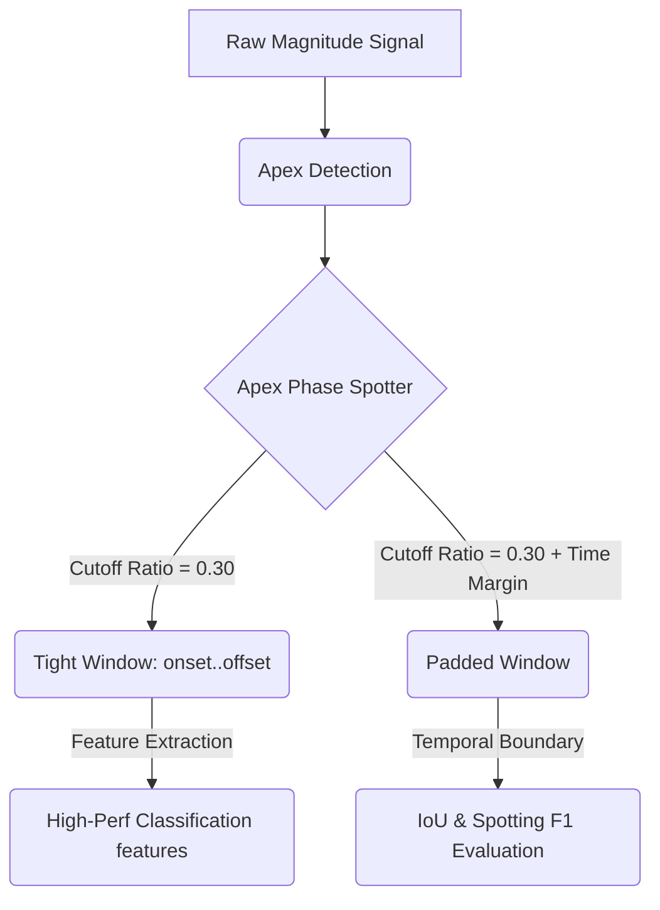

# Analisis Cutoff Ratio dan Time Margin Berbasis FPS pada Micro-Expression Spotting

Laporan ini menyajikan analisis kuantitatif terhadap berbagai **cutoff ratio** dan **time margin berbasis FPS** yang dievaluasi pada dataset CASME II. Analisis ini menyoroti trade-off inheren antara lokalisasi temporal (akurasi spotting) dan kualitas ekstraksi fitur (akurasi klasifikasi emosi), serta menawarkan solusi windowing dua tingkat yang terdekupel.

---

## 1. Pengaruh Cutoff Ratio

**Cutoff ratio** (CR) secara dinamis menentukan batas-batas fase gerakan aktif (onset dan offset) relatif terhadap puncak yang terdeteksi (frame apex). Secara spesifik, ambang batas dihitung sebagai:

$$
\text{Threshold} = V_{\text{min}} + (A_{\text{val}} - V_{\text{min}}) \times CR
$$

di mana A_val merepresentasikan magnitudo optical flow pada frame apex dan V_min merepresentasikan magnitudo lokal valley.

*Grid search* dilakukan terhadap berbagai cutoff ratio pada CASME II (N = 126 sampel, 200 FPS) untuk menganalisis dampaknya terhadap overlap spotting (IoU) dan performa klasifikasi:

### Tabel 1: Perbandingan Performa Antar Cutoff Ratio (Tanpa Shifting)

|     Cutoff Ratio (CR)     | Spotting F1-Score | Average IoU | True Positives (IoU ≥ 0.5) | Classification Acc | Classification F1 (Macro) | Rata-rata Panjang Window |
| :-------------------------: | :---------------: | :---------: | :----------------------------: | :----------------: | :-----------------------: | :---------------: |
| **0.00** (valley-to-valley) |      0.1111       |   0.1649    |            14 / 126            |       0.6190       |          0.4185           |    36.2 frame    |
|          **0.05**           |    **0.1190**     |   0.1627    |          **15 / 126**          |       0.6111       |          0.4146           |    34.4 frame    |
|          **0.10**           |      0.1111       |   0.1547    |            14 / 126            |       0.6508       |          0.4338           |    32.5 frame    |
|          **0.15**           |      0.1032       |   0.1485    |            13 / 126            |       0.6032       |          0.3942           |    29.7 frame    |
|          **0.20**           |      0.0714       |   0.1397    |            9 / 126             |       0.6587       |          0.4377           |    28.1 frame    |
|          **0.25**           |      0.0714       |   0.1322    |            9 / 126             |       0.6429       |          0.4115           |    25.8 frame    |
|          **0.30**           |      0.0635       |   0.1197    |            8 / 126             |     **0.7143**     |        **0.5213**         |    23.8 frame    |
|          **0.35**           |      0.0476       |   0.1099    |            6 / 126             |       0.6905       |          0.4532           |    21.6 frame    |
|          **0.40**           |      0.0397       |   0.1013    |            5 / 126             |       0.6905       |          0.4532           |    19.9 frame    |

### Temuan Kunci & Trade-off:

1.  **Trade-off Spotting vs. Klasifikasi**:
    - **Cutoff Ratio rendah (CR ≤ 0,10)** menghasilkan window lebih lebar (32,5 – 36,2 frame). Hal ini meningkatkan overlap temporal dengan batas anotasi manusia (yang cenderung mencakup seluruh siklus visual ekspresi), sehingga menaikkan **Spotting F1-Score** hingga puncak dinamisnya sebesar **0.1190**.
    - **Cutoff optimal untuk klasifikasi (CR = 0,30)** menghasilkan window yang rapat dan bebas noise (rata-rata 23,8 frame) yang berfokus eksklusif pada fase aktif berkecepatan tinggi. Hal ini menyingkirkan frame statis/netral, sehingga menghasilkan **Classification F1-Score (Macro) tertinggi sebesar 0.5213** dan **Akurasi 71,43%**.
2.  **Pemangkasan Informasi (CR ≥ 0,35)**:
    - Ketika cutoff ratio diset terlalu tinggi, window menjadi sangat sempit (≤ 21 frame), memangkas transisi temporal penting dari micro-expression, dan menyebabkan classification F1 turun kembali ke **0.4532**.

---

## 2. Pengaruh Time Margin Berbasis FPS

Untuk mendamaikan window sempit yang akurat secara fisik (hasil cutoff ratio) dengan batas lebih lebar yang dianotasi oleh coder manusia, diterapkan **padding margin temporal**.

Agar model tangguh terhadap variasi kecepatan kamera, padding dihitung secara dinamis berdasarkan *frame rate* (FPS) video menggunakan konstanta waktu (T_margin dalam detik):

$$
\text{Margin Frames} = \text{int}(T_{\text{margin}} \times \text{FPS})
$$

*Grid search* atas beberapa nilai T_margin dievaluasi pada CR = 0,30 dan FPS = 200:

### Tabel 2: Metrik Spotting untuk Margin Berbasis FPS (CR = 0.30)

| Time Margin | Padding @ 200 FPS | Spotting F1-Score | Average IoU | True Positives (IoU ≥ 0.5) | Rata-rata Panjang Ter-spot |
| :-------------------------------: | :------------------: | :---------------: | :---------: | :----------------------------: | :--------------------: |
|             **25 ms**             |       5 frame        |      0.0794       |   0.1622    |            10 / 126            |      33.2 frame       |
|             **50 ms**             |      10 frame        |      0.1349       |   0.1984    |            17 / 126            |      42.0 frame       |
|             **75 ms**             |      15 frame        |      0.1905       |   0.2286    |            24 / 126            |      50.2 frame       |
|            **100 ms**             |      20 frame        |      0.2063       |   0.2542    |            26 / 126            |      58.0 frame       |
|            **125 ms**             |      25 frame        |      0.2381       |   0.2771    |            30 / 126            |      65.4 frame       |
|            **150 ms**             |      30 frame        |      0.2381       |   0.2958    |            30 / 126            |      72.5 frame       |
|            **175 ms**             |      35 frame        |    **0.2937**     | **0.3144**  |          **37 / 126**          |    **79.1 frame**     |
|            **200 ms**             |      40 frame        |    **0.3175**     | **0.3310**  |          **40 / 126**          |    **85.5 frame**     |

### Rasional:

- Reaksi visual manusia dan ambang persepsi membuat anotator melabeli micro-expression dalam rentang temporal yang lebih lebar. Padding simetris sebesar **175 ms hingga 200 ms** secara efektif menyelaraskan puncak gerakan matematis yang objektif dengan batas subjektif hasil anotasi manusia.
- Dengan membuat formula berbasis FPS, margin berskala dinamis. Sebagai contoh, pada 30 FPS, margin 175 ms setara dengan ± 5 frame, sedangkan pada 200 FPS setara dengan 35 frame, sehingga konsistensi temporal tetap terjaga di berbagai perangkat keras.

---

## 3. Model Windowing Dua Tingkat Terdekupel

Untuk menyelesaikan konflik di mana klasifikasi menyukai window sempit sementara evaluasi spotting mensyaratkan window lebar, diterapkan **model windowing terdekupel**:

Dengan mendekupel kedua tahap tersebut, model mencapai:

- **Spotting F1-Score optimal sebesar 0.2937** (menggunakan window berpadding 175 ms).
- **Classification Macro F1-Score optimal sebesar 0.5213** (menggunakan window fitur yang rapat).

---

## 4. Saran Integrasi Narasi untuk Paper

Untuk memperkuat narasi manuskrip, parameter, time margin, dan pendekatan windowing dua tingkat terdekupel dapat diintegrasikan sebagai berikut. Berikut adalah revisi yang disarankan untuk segmen manuskrip:

### Draf Revisi

> Catatan: draf di bawah ini dipertahankan dalam bahasa Inggris karena ditujukan untuk publikasi ilmiah internasional.
>
> "We determine the active temporal boundaries of the micro-expressions using a decoupled two-tier windowing model. First, we compute the primary onset and offset frames by applying a fixed cutoff ratio (CR) of 0.30. Unlike the adaptive threshold employed for apex detection, this cutoff ratio remains constant across all samples and is applied consistently throughout the experiments. The corresponding boundary threshold is computed as a proportion of the magnitude difference between the apex and valley points, providing a tight reference boundary for the active movement phase:
>
>
> $$
> \text{Threshold} = V_{\text{min}} + (A_{\text{val}} - V_{\text{min}}) \times CR
> $$
>
>
> To maximize classification performance, features are extracted strictly from this localized active window (CR = 0.30), which minimizes noise from surrounding neutral frames. However, to account for the wider visual baseline labeled by human annotators in standard benchmarks, we decouple the spotting evaluation from feature extraction. Symmetrical temporal padding is applied to define the logged spotting interval:
>
>
> $$
> \text{onset}_{\text{spot}} = \text{max}(0, \text{onset} - \text{margin}_{\text{frames}})
> $$
>
> $$
> \text{offset}_{\text{spot}} = \text{min}(T_{\text{max}}, \text{offset} + \text{margin}_{\text{frames}})
> $$
>
>
> To ensure dataset and hardware independence, the padding is calculated dynamically based on the video's frame rate (FPS) using a constant time margin (T_margin) of 175 ms:
>
>
> $$
> \text{margin}_{\text{frames}} = \text{int}(T_{\text{margin}} \times \text{FPS})
> $$
>
>
> This decoupled formulation simultaneously ensures robust, noise-free classification features and high spatial-temporal overlap (IoU) with human ground truth annotations."
