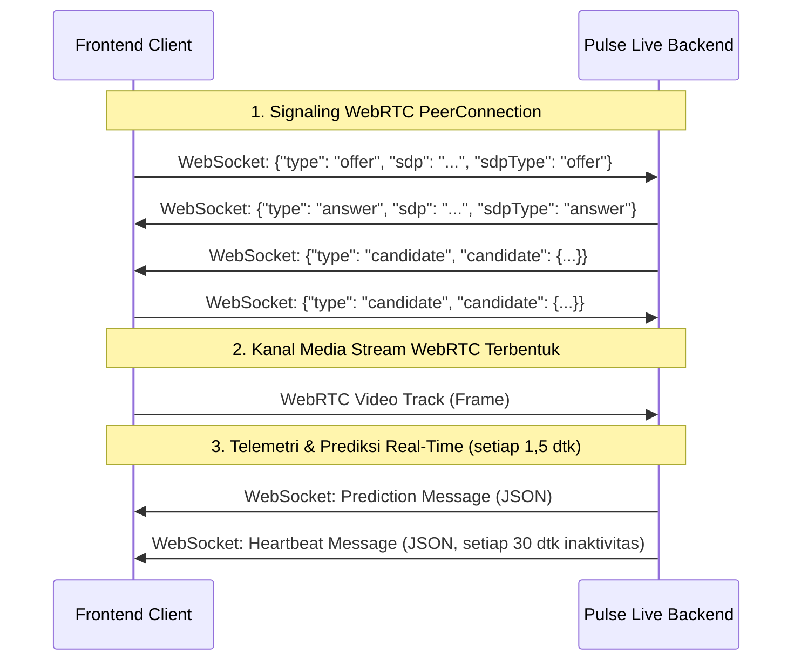
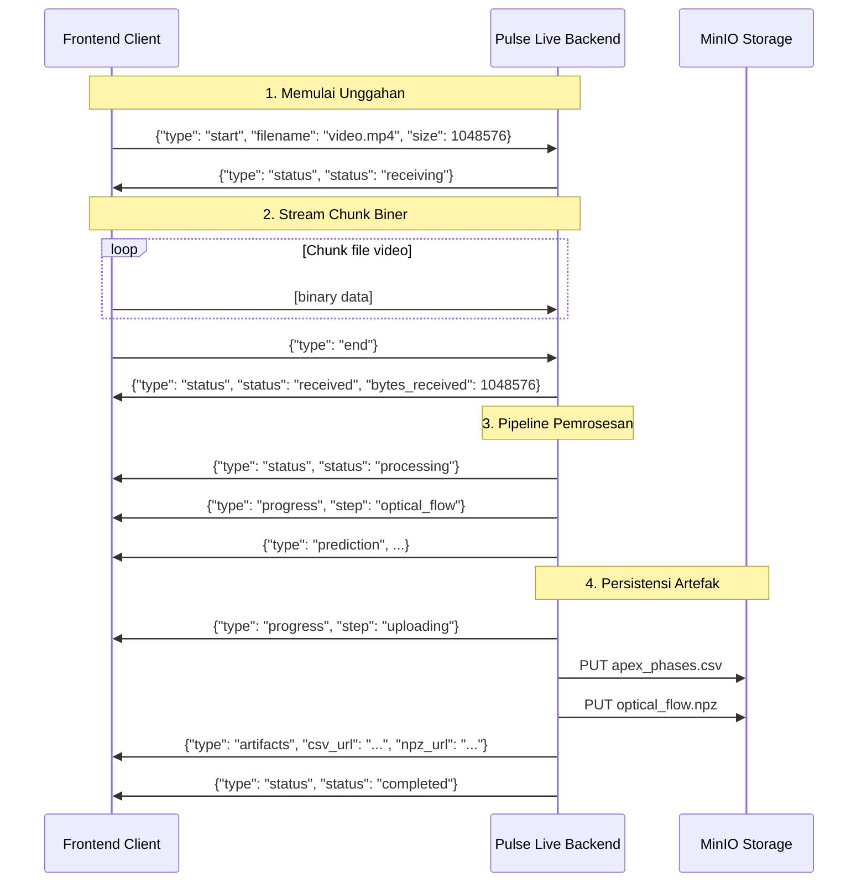

# Kontrak API: Streaming Video & Koneksi Telemetri WebRTC dan WebSocket

Dokumen ini mendefinisikan kontrak antarmuka antara frontend dan backend `pulse-live` untuk streaming video *real-time*, overlay *bounding box* wajah, analitik magnitudo, serta analisis fase ter-spot.

## Endpoint Koneksi

### 1. Route Signaling WebRTC dan Telemetri
* **Protokol**: Secure WebSocket (`wss://` atau `ws://`)
* **Endpoint**: `/ws/rtc/{session_id}`
* **Parameter**:
  * `session_id` (string): Identifier sesi unik yang ditetapkan klien.

### 2. Route Streaming Frame Video Biner dan Telemetri
* **Protokol**: Secure WebSocket (`wss://` atau `ws://`)
* **Endpoint**: `/ws/stream/{session_id}`
* **Parameter**:
  * `session_id` (string): Identifier sesi unik yang ditetapkan klien.
* **Format Pesan**:
  * **Klien -> Server**: Pesan biner berisi byte gambar terkompresi mentah (misalnya format JPEG, PNG, atau WebP). Laju streaming yang disarankan adalah **15 FPS**.
  * **Server -> Klien**: Pesan teks JSON dengan tipe `"bbox"`, `"prediction"`, `"heartbeat"`, atau `"error"` sesuai skema telemetri di bawah.

---

## Gambaran Alur Pesan



---

## Skema JSON & Spesifikasi Pesan

Seluruh komunikasi melalui WebSocket menggunakan JSON. Tipe setiap pesan diidentifikasi melalui field `"type"`.

### 1. Pesan Signaling WebRTC

#### SDP Offer (Klien -> Server)
Dikirim oleh frontend untuk memulai jabat tangan WebRTC.
```json
{
  "type": "offer",
  "sdp": "v=0\no=- 85657...",
  "sdpType": "offer"
}
```

#### SDP Answer (Server -> Klien)
Dikirim oleh backend sebagai jawaban atas offer.
```json
{
  "type": "answer",
  "sdp": "v=0\no=- 12948...",
  "sdpType": "answer"
}
```

#### ICE Candidate (Dua Arah)
Pertukaran untuk membangun kandidat koneksi peer-to-peer.
```json
{
  "type": "candidate",
  "candidate": {
    "candidate": "candidate:84216...",
    "sdpMid": "0",
    "sdpMLineIndex": 0
  }
}
```

---

### 2. Pesan Telemetri & Prediksi (Server -> Klien)

Setiap **1,5 detik**, server menjalankan pemrosesan *optical flow* dan inferensi model pada window frame yang terakumulasi (default **15 FPS**, target **22-23 frame** per window) dan mengembalikan telemetri.

#### Skema Payload Prediksi (`"type": "prediction"`)
```json
{
  "type": "prediction",
  "label": "low",
  "confidence": 0.9842,
  "prob_high": 0.0158,
  "prob_low": 0.9842,
  "n_apex_detected": 1,
  "n_frames": 23,
  "warning": null,
  "top_features": [
    {
      "name": "right_eye_amplitude",
      "value": 1.4589,
      "saliency": 0.3541,
      "direction": "up"
    }
  ],
  "face_bboxes": [
    {
      "x": 0.312,
      "y": 0.201,
      "width": 0.385,
      "height": 0.452,
      "abs_x": 199,
      "abs_y": 96,
      "abs_width": 246,
      "abs_height": 216
    },
    null
  ],
  "magnitudes": [
    0.1042,
    0.1245
  ],
  "smoothed_magnitudes": [
    0.1012,
    0.1189
  ],
  "detected_phases": [
    {
      "onset": 3,
      "apex": 8,
      "offset": 12
    }
  ],
  "latency_ms": 142.58
}
```

#### Spesifikasi Field Telemetri:

| Nama Field | Tipe | Deskripsi |
| :--- | :--- | :--- |
| `type` | `string` | Selalu `"prediction"`. |
| `label` | `string` | Label klasifikasi hasil prediksi (misalnya `"low"`, `"high"`). |
| `confidence` | `float` | Skor kepercayaan prediksi `[0.0, 1.0]`. |
| `n_apex_detected` | `int` | Jumlah puncak micro-expression yang terdeteksi pada window ini. |
| `n_frames` | `int` | Total frame yang dianalisis pada window saat ini. |
| `face_bboxes` | `array` | Daftar bounding box wajah yang berkorespondensi satu-satu dengan setiap frame pada window. Bernilai `null` jika tidak ada wajah terdeteksi pada frame tertentu. |
| `face_bboxes[i].x` | `float` | Koordinat X ternormalisasi dari sudut kiri atas bounding box wajah `[0.0, 1.0]`. |
| `face_bboxes[i].y` | `float` | Koordinat Y ternormalisasi dari sudut kiri atas bounding box wajah `[0.0, 1.0]`. |
| `face_bboxes[i].width` | `float` | Lebar ternormalisasi bounding box wajah `[0.0, 1.0]`. |
| `face_bboxes[i].height` | `float` | Tinggi ternormalisasi bounding box wajah `[0.0, 1.0]`. |
| `face_bboxes[i].abs_x` | `int` | Koordinat X piksel absolut dari sudut kiri atas. |
| `face_bboxes[i].abs_y` | `int` | Koordinat Y piksel absolut dari sudut kiri atas. |
| `face_bboxes[i].abs_width`| `int` | Lebar bounding box dalam piksel absolut. |
| `face_bboxes[i].abs_height`| `int` | Tinggi bounding box dalam piksel absolut. |
| `magnitudes` | `array[float]` | Magnitudo rata-rata optical flow mentah per transisi frame (panjangnya `n_frames - 1`). |
| `smoothed_magnitudes` | `array[float]` | Magnitudo hasil penghalusan Savitzky-Golay yang digunakan untuk pencarian puncak (panjangnya `n_frames - 1`). |
| `detected_phases` | `array[object]`| Daftar fase micro-expression yang ter-spot pada window saat ini. |
| `detected_phases[i].onset` | `int` | Indeks frame awal (valley/onset) fase pada window. |
| `detected_phases[i].apex` | `int` | Indeks frame puncak (apex) fase pada window. |
| `detected_phases[i].offset`| `int` | Indeks frame akhir (valley/offset) fase pada window. |
| `latency_ms` | `float` | Latensi eksekusi pipeline dalam milidetik (misalnya `142.58`). |

---

### 3. Pesan Bounding Box Wajah Real-Time (Server -> Klien)

Dikirim segera untuk setiap frame video masuk agar rendering overlay pelacakan dapat dilakukan dengan latensi serendah mungkin.

#### Skema Payload Bounding Box (`"type": "bbox"`)
```json
{
  "type": "bbox",
  "bbox": {
    "x": 0.312,
    "y": 0.201,
    "width": 0.385,
    "height": 0.452,
    "abs_x": 199,
    "abs_y": 96,
    "abs_width": 246,
    "abs_height": 216
  },
  "latency_ms": 22.45
}
```

Jika tidak ada wajah terdeteksi pada frame saat ini, `bbox` bernilai `null`:
```json
{
  "type": "bbox",
  "bbox": null,
  "latency_ms": 21.84
}
```

---

### 4. Pesan Alert (Server -> Klien)

Dikirim ketika kondisi tertentu terpenuhi selama inferensi. Saat ini digunakan untuk memberi tahu ketika tingkat kecemasan tinggi (`anxiety_tinggi`) terdeteksi.
```json
{
  "type": "alert",
  "alert_type": "anxiety_tinggi",
  "message": "Terdeteksi Tingkat Kecemasan Tinggi"
}
```

---

### 5. Pesan Heartbeat (Server -> Klien)

Dikirim setiap **30 detik** inaktivitas untuk menjaga koneksi tetap hidup.
```json
{
  "type": "heartbeat"
}
```

---

### 6. Pesan Error (Server -> Klien)

Dikembalikan ketika server mengalami masalah pemrosesan atau koneksi yang bersifat kritikal.
```json
{
  "type": "error",
  "message": "Internal server error"
}
```

---

## Endpoint Pemrosesan File Video

### Route Unggah Video dan Pemrosesan Batch
* **Protokol**: WebSocket (`wss://` atau `ws://`)
* **Endpoint**: `/ws/video/{session_id}`
* **Parameter**:
  * `session_id` (string): Identifier sesi unik yang ditetapkan klien.
* **Tujuan**: Mengunggah file video utuh, menjalankan pipeline inferensi penuh (sama seperti WebRTC), dan menyimpan artefak CSV fase apex serta NPZ optical flow ke object storage MinIO.

---

### Alur Pesan Pemrosesan Video



---

### Pesan Pemrosesan Video (Klien -> Server)

#### Mulai Unggahan
Dikirim pertama untuk mendeklarasikan file video yang akan dikirim.
```json
{
  "type": "start",
  "filename": "interview_clip.mp4",
  "size": 1048576
}
```

| Field | Tipe | Deskripsi |
| :--- | :--- | :--- |
| `type` | `string` | Selalu `"start"`. |
| `filename` | `string` | Nama file asli (digunakan untuk deteksi ekstensi). |
| `size` | `int` | Ukuran file yang diharapkan dalam byte (informatif). |

#### Chunk Data Biner
Setelah pesan `"start"`, klien men-streaming frame biner WebSocket mentah yang berisi konten file video. Ukuran chunk ditentukan oleh klien (disarankan: 64 KB–1 MB).

#### Akhir Unggahan
Dikirim setelah semua chunk biner sebagai sinyal bahwa unggahan selesai.
```json
{
  "type": "end"
}
```

---

### Pesan Pemrosesan Video (Server -> Klien)

#### Pesan Status (`"type": "status"`)
```json
{
  "type": "status",
  "status": "receiving | received | processing | completed",
  "message": "Deskripsi status yang mudah dibaca.",
  "bytes_received": 1048576
}
```

| Field | Tipe | Deskripsi |
| :--- | :--- | :--- |
| `status` | `string` | Salah satu dari `"receiving"`, `"received"`, `"processing"`, `"completed"`. |
| `message` | `string` | Deskripsi yang mudah dibaca. |
| `bytes_received` | `int` | *(Hanya pada `"received"`)* Total byte yang diterima. |

#### Pesan Progres (`"type": "progress"`)
```json
{
  "type": "progress",
  "step": "optical_flow | uploading",
  "message": "Optical flow extracted. 150 frames, 3 apex detected.",
  "n_frames": 150,
  "n_apex": 3
}
```

| Field | Tipe | Deskripsi |
| :--- | :--- | :--- |
| `step` | `string` | Tahapan pipeline: `"optical_flow"` atau `"uploading"`. |
| `message` | `string` | Deskripsi progres yang mudah dibaca. |
| `n_frames` | `int` | *(Hanya pada `"optical_flow"`)* Total frame yang diproses. |
| `n_apex` | `int` | *(Hanya pada `"optical_flow"`)* Jumlah puncak apex yang terdeteksi. |

#### Pesan Prediksi (`"type": "prediction"`)
Skema sama dengan prediksi real-time (Bagian 2), tetapi tanpa `face_bboxes` dan `latency_ms`.
Untuk endpoint ini, `magnitudes` berisi sinyal **terhalus** yang digunakan untuk phase spotting, dan `raw_magnitudes` berisi sinyal tanpa penghalusan:
```json
{
  "type": "prediction",
  "label": "high",
  "confidence": 0.8721,
  "prob_high": 0.8721,
  "prob_low": 0.1279,
  "n_apex_detected": 3,
  "n_frames": 150,
  "warning": null,
  "top_features": [
    {
      "name": "apex1_lips_mean_mag",
      "value": 2.3401,
      "saliency": 0.5123,
      "direction": "high"
    }
  ],
  "magnitudes": [0.1012, 0.1189, 0.0971],
  "raw_magnitudes": [0.1042, 0.1245, 0.0983],
  "detected_phases": [
    {"onset": 12, "apex": 28, "offset": 41}
  ],
  "inference_diagnostics": {
    "strict_notebook_parity": true,
    "spotter_detect_interval": 1,
    "spotter_tvl1_fast_mode": false,
    "flow_shape": [149, 5, 2, 64, 64],
    "inferencer_loaded": true,
    "threshold": 0.625,
    "n_tta": 8,
    "detector_percentile": 95.0,
    "detector_prominence": 0.5,
    "phases": ["onset", "apex"],
    "max_seq_len": 512,
    "checkpoint_path": "combinations-notebooks/checkpoints_0407-onset-apex-behavior-cnn-transformer/best_model.pt"
  }
}
```

#### URL Artefak (`"type": "artifacts"`)
Dikembalikan setelah artefak inferensi berhasil diunggah ke MinIO.
```json
{
  "type": "artifacts",
  "csv_url": "http://localhost:9000/pulse-live/sessions/.../apex_phases.csv?...",
  "npz_url": "http://localhost:9000/pulse-live/sessions/.../optical_flow.npz?...",
  "csv_key": "sessions/{session_id}/{timestamp}/apex_phases.csv",
  "npz_key": "sessions/{session_id}/{timestamp}/optical_flow.npz"
}
```

| Field | Tipe | Deskripsi |
| :--- | :--- | :--- |
| `csv_url` | `string` | URL unduhan pre-signed untuk CSV fase apex (kedaluwarsa dalam 1 jam). |
| `npz_url` | `string` | URL unduhan pre-signed untuk NPZ optical flow (kedaluwarsa dalam 1 jam). |
| `csv_key` | `string` | Object key MinIO untuk file CSV. |
| `npz_key` | `string` | Object key MinIO untuk file NPZ. |

#### Struktur Storage MinIO
```
pulse-live/                              ← bucket
└── sessions/
    └── {session_id}/
        └── {YYYYMMDD_HHMMSS}/
            ├── apex_phases.csv          ← indeks onset/apex/offset + magnitudo
            └── optical_flow.npz         ← vektor flow mentah terkompresi (hanya dx/dy)
```

#### Isi NPZ Optical Flow

| Key | Tipe | Deskripsi |
| :--- | :--- | :--- |
| `dx` | `float16[T, H, W]` | Komponen horizontal optical flow mentah per pasangan frame (penyimpanan ringkas). |
| `dy` | `float16[T, H, W]` | Komponen vertikal optical flow mentah per pasangan frame (penyimpanan ringkas). |

#### Kolom CSV Apex Phases

| Kolom | Tipe | Deskripsi |
| :--- | :--- | :--- |
| `session_id` | `string` | Identifier sesi. |
| `phase_idx` | `int` | Indeks fase (mulai dari nol). |
| `onset` | `int` | Indeks frame onset fase. |
| `apex` | `int` | Indeks frame apex (puncak) fase. |
| `offset` | `int` | Indeks frame offset fase. |
| `onset_mag` | `float` | Magnitudo optical flow pada frame onset. |
| `apex_mag` | `float` | Magnitudo optical flow pada frame apex. |
| `offset_mag` | `float` | Magnitudo optical flow pada frame offset. |

---

## Endpoint Riwayat Deteksi

### 1. Daftar Semua Sesi Deteksi
* **Protokol**: HTTP GET
* **Endpoint**: `/history`
* **Tujuan**: Mengambil daftar semua sesi tercatat beserta jumlah total deteksi pada masing-masing sesi.

#### Skema Respons
```json
{
  "sessions": [
    {
      "session_id": "123e4567-e89b-12d3-a456-426614174000",
      "total_detections": 2
    }
  ]
}
```

### 2. Detail Deteksi Sesi
* **Protokol**: HTTP GET
* **Endpoint**: `/history/{session_id}`
* **Parameter**:
  * `session_id` (string): Identifier sesi.
* **Tujuan**: Mengambil daftar semua ID deteksi yang tercatat pada sesi yang ditentukan.

#### Skema Respons
```json
{
  "detections": [
    "a1b2c3d4e5f6",
    "8f7e6d5c4b3a"
  ]
}
```

### 3. Ringkasan Detail Deteksi
* **Protokol**: HTTP GET
* **Endpoint**: `/history/{session_id}/{detection_id}/summary`
* **Parameter**:
  * `session_id` (string): Identifier sesi.
  * `detection_id` (string): Identifier run deteksi tertentu.
* **Tujuan**: Mengambil output JSON telemetri persis seperti yang dihasilkan dan diarsipkan pada saat run inferensi.

#### Skema Respons
Responsnya adalah JSON telemetri prediksi lengkap (sesuai skema pada **Bagian 2: Pesan Telemetri & Prediksi** di atas).

```json
{
  "type": "prediction",
  "label": "low",
  "confidence": 0.9842,
  "detection_id": "a1b2c3d4e5f6",
  "n_windows": 1,
  "n_frames": 23,
  "face_bboxes": [...],
  "magnitudes": [...],
  "smoothed_magnitudes": [...],
  "detected_phases": [...],
  "latency_ms": 142.58
}
```

### 4. Batch Deteksi Sesi
* **Protokol**: HTTP GET
* **Endpoint**: `/history/{session_id}/batch`
* **Parameter**:
  * `session_id` (string): Identifier sesi.
* **Tujuan**: Mengambil semua ringkasan deteksi untuk sesi tertentu dalam satu permintaan batch, sehingga tidak perlu banyak panggilan API.

#### Skema Respons
```json
{
  "detections": [
    {
      "type": "prediction",
      "label": "low",
      "confidence": 0.9842,
      "detection_id": "a1b2c3d4e5f6",
      ...
    },
    {
      "type": "prediction",
      "label": "high",
      "confidence": 0.8123,
      "detection_id": "8f7e6d5c4b3a",
      ...
    }
  ]
}
```

### 5. Rekap Latensi Sesi
* **Protokol**: HTTP GET
* **Endpoint**: `/history/{session_id}/latencies`
* **Parameter**:
  * `session_id` (string): Identifier sesi.
* **Tujuan**: Mengambil rekap ringkas seluruh latensi pipeline per fase deteksi untuk sesi tertentu.

#### Skema Respons
```json
{
  "latencies": [
    {
      "detection_id": "a1b2c3d4e5f6",
      "webrtc_latency_avg_ms": 12.5,
      "landmark_latency_avg_ms": 35.2,
      "flow_latency_avg_ms": 40.1,
      "spotting_latency_ms": 5.4,
      "model_inference_latency_ms": 48.3,
      "total_latency_ms": 142.58
    }
  ]
}
```

### 6. Ringkasan Latensi Global
* **Protokol**: HTTP GET
* **Endpoint**: `/history/latencies/summary`
* **Tujuan**: Mengambil agregasi dan rata-rata global dari semua latensi di seluruh deteksi dan seluruh sesi yang pernah terekam.

#### Skema Respons
```json
{
  "total_detections_analyzed": 1542,
  "global_averages": {
    "average_fps": 14.67,
    "webrtc_latency_avg_ms": 11.2,
    "landmark_latency_avg_ms": 34.8,
    "flow_latency_avg_ms": 39.5,
    "spotting_latency_ms": 5.1,
    "model_inference_latency_ms": 47.9,
    "total_latency_ms": 138.5
  }
}
```
