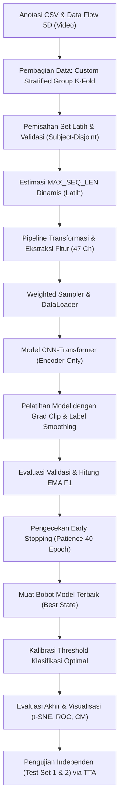

# Dokumentasi Teknis & Justifikasi Desain Eksperimen
**Model CNN-Transformer pada File [0407-onset-apex-behavior-cnn-transformer.ipynb](../combinations-notebooks/0407-onset-apex-behavior-cnn-transformer.ipynb)**

Dokumen ini berisi catatan teknis implementasi, dokumentasi parameter, serta analisis dan justifikasi ilmiah atas keputusan desain model yang digunakan dalam eksperimen deteksi kecemasan berbasis gerakan wajah.

---

## 1. Diagram Alur Pipeline

> [!NOTE]
> Bagan alur di bawah ini merangkum proses komputasi yang berjalan pada sistem secara vertikal linier, mulai dari pemrosesan data mentah hingga pengujian independen:



---

## 2. Catatan Narasi Teknis

### 1. Deskripsi Umum dan Tujuan Pemodelan
> "Pada eksperimen ini, saya fokus untuk melatih dan mengevaluasi model deep learning untuk klasifikasi biner tingkat kecemasan (anxiety rendah vs tinggi) berbasis analisis sekuens ekspresi wajah temporal. Ruang lingkup data yang dianalisis adalah fase gerakan dari *onset* menuju *apex*."

### 2. Penanganan Kebocoran Subjek (Subject Leakage)
> "Untuk pembagian data latih dan validasi, saya menggunakan pembagian berbasis subjek (*subject-disjoint split*) melalui modul kustom `custom_sgkf_train_val_split`. Modul ini mengombinasikan `StratifiedGroupKFold` dengan pencarian kombinasi fold optimal secara heuristik. Tujuannya adalah memastikan tidak ada subjek (orang) yang sama di set latih dan validasi sekaligus menjaga kemiripan distribusi kelas di kedua set tersebut tetap seimbang."

### 3. Ekstraksi Fitur Perilaku Temporal (Behavioral Features)
> "Sebagai fitur masukan model, saya mengekstrak 47 saluran fitur perilaku per frame wajah melalui kelas [BehavioralFeatures](../src/dataset/modules/behavioral_features.py). Fitur ini diturunkan dari 5 Region of Interest (ROI) wajah (mata, alis, dan bibir) yang mencakup magnitudo, energi kinetik, konsistensi arah, akselerasi, *jerk*, sinkronisasi antar-ROI, serta tingkat simetri gerakan."

### 4. Penyeimbangan Distribusi Kelas (Imbalance Sampling)
> "Karena dataset memiliki ketidakseimbangan kelas yang cukup menonjol, saya menerapkan `WeightedRandomSampler` di DataLoader latihan. Metode ini memberikan bobot probabilitas penarikan sampel yang lebih tinggi untuk kelas minoritas (kecemasan tinggi) sehingga model menerima batch data yang seimbang di setiap epoch latihan."

### 5. Integrasi Arsitektur Transformer Encoder
> "Model yang diimplementasikan adalah [CNN_Transformer](../src/models/modules/cnn_transformer/cnn_transformer.py) (Transformer Encoder Only). Saluran input berdimensi 47 diproyeksikan secara linier ke dimensi tersembunyi 64, dipadukan dengan positional encoding, lalu dilewatkan pada 2 layer Transformer Encoder. Agregasi fitur temporal dilakukan melalui *Masked Global Average Pooling* untuk mengabaikan kontribusi frame padding."

### 6. Regulasi Pelatihan & Kriteria Penghentian (Early Stopping)
> "Pelatihan dilakukan menggunakan optimizer AdamW dengan learning rate scheduler bertipe kombinasi Linear Warmup (10 epoch) dan Cosine Annealing. Loss function yang digunakan adalah Cross Entropy dengan *Label Smoothing* 0.15. Penghentian pelatihan dikontrol oleh *Early Stopping* yang memantau pergerakan Exponential Moving Average (EMA) dari metrik F1 validasi untuk menghindari overfitting pada data validasi."

### 7. Kalibrasi Threshold & Proyeksi Representasi (t-SNE)
> "Setelah pelatihan, saya mencari ambang batas keputusan klasifikasi optimal (*threshold calibration*) menggunakan data validasi untuk memaksimalkan skor Macro F1. Analisis performa kemudian divisualisasikan melalui Confusion Matrix, kurva ROC, serta visualisasi pemisahan ruang fitur menggunakan proyeksi reduksi dimensi t-SNE."

### 8. Uji Keandalan Generalisasi (Independent Test)
> "Evaluasi akhir model dilakukan secara independen pada dataset eksternal (`dataset_test` dan `dataset_test_2`) dengan menerapkan teknik Test-Time Augmentation (TTA). Teknik ini membantu menguji apakah model yang dilatih memiliki daya generalisasi yang baik terhadap variasi perekaman wajah dan karakteristik subjek baru di luar data latih."

---

## 3. Konfigurasi Parameter Global

| Nama Konstanta / Variabel | Nilai Default | Dampak Teknis & Parameterisasi |
| :--- | :--- | :--- |
| `MAX_SEQ_LEN_CAP` | `512` | Batas atas dimensi temporal. Mencegah pembengkakan penggunaan memori GPU yang bersifat kuadratik `O(T^2)` pada fungsi attention akibat video yang terlalu panjang. |
| `MAX_SEQ_LEN_PERCENTILE`| `95` | Persentil panjang video latih sebagai acuan target padding untuk mempertahankan 95% durasi asli data sekuensial. |
| `AUG_SCALE_RANGE` | `(0.95, 1.05)`| Rentang augmentasi skala temporal untuk memodelkan variasi kecepatan kontraksi otot wajah. |
| `AUG_NOISE_STD` | `0.005` | Standar deviasi noise Gaussian untuk menjaga kestabilan model terhadap *tracking error*. |
| `DETECTOR_PROMINENCE` | `0.5` | Tinggi ambang puncak pergerakan lokal untuk menghindari puncak gerakan palsu (*micro-tremor*). |
| `THRESHOLD_METRIC` | `"macro_f1"` | Target metrik kalibrasi threshold untuk memastikan keseimbangan presisi dan recall pada kelas minoritas. |
| `BATCH_SIZE` | `8` | Ukuran batch optimal untuk menjaga stabilitas gradien di memori GPU. |
| `LR` | `2e-4` | Learning rate awal yang optimal untuk stabilitas pembaruan bobot Transformer. |
| `WEIGHT_DECAY` | `1e-2` | Kekuatan regularisasi L2 untuk mencegah bobot model menjadi terlalu ekstrem (overfitting). |
| `WARMUP_EPOCHS` | `10` | Fase transisi pemanasan learning rate untuk menstabilkan inisialisasi gradien di epoch-epoch awal. |
| `PATIENCE` | `40` | Toleransi jumlah epoch tanpa perbaikan performa sebelum memicu *Early Stopping*. |
| `EMA_ALPHA` | `0.3` | Koefisien penghalusan EMA untuk menyaring fluktuasi *noisy epoch* pada metrik validasi. |
| `LABEL_SMOOTH` | `0.15` | Regularisasi target probabilitas loss function untuk meningkatkan batas keputusan klasifikasi yang luwes. |
| `N_TTA` | `8` | Jumlah sampel augmentasi yang diuji saat inferensi guna mereduksi sensitivitas model terhadap noise spasial-temporal. |
| `PHASES` | `["onset", "apex"]`| Pemilihan fase gerakan wajah yang dianalisis untuk memfokuskan model pada puncak ketegangan emosional. |

---

## 4. Diskusi Ilmiah & Justifikasi Desain

### 1. Justifikasi Skema Pembagian Data Latih-Validasi
*   **Topik Diskusi:** Bahaya *Subject Leakage* dan keterbatasan StratifiedGroupKFold standar.
*   **Analisis Ilmiah:** 
    *   Jika video dari subjek yang sama tersebar di set latih dan validasi, model cenderung mempelajari identitas anatomis wajah orang tersebut ketimbang pola pergerakan ekspresi kecemasannya. Ini memicu bias evaluasi yang semu (*overoptimistic evaluation*).
    *   Meskipun StratifiedGroupKFold bawaan memisahkan subjek, ia membagi data secara sekuensial-deterministik satu kali, yang sering kali menyisakan deviasi kelas yang timpang pada dataset ukuran kecil. 
    *   Dengan melakukan pencarian kombinasi fold terbaik (`custom_sgkf_train_val_split`), sistem secara matematis menyeimbangkan kelas cemas rendah/tinggi sekaligus menjaga batasan subjek tetap disjoint menggunakan formula penalti:
        ```text
        Score = ratio_err + (0.5 * class_drift_l1) + (0.2 * group_ratio_err)
        ```

### 2. Justifikasi Rekayasa Fitur dan Non-aktif Z-Score
*   **Topik Diskusi:** Konstruksi 47 fitur perilaku dan keputusan mematikan `ChannelZScore`.
*   **Analisis Ilmiah:** 
    *   Setiap video wajah diwakili oleh pergerakan 5 ROI (mata kiri, mata kanan, bibir, alis kiri, alis kanan). Dari setiap ROI dihitung 7 metrik temporal (mean X, mean Y, magnitude, energy, direction consistency, acceleration, jerk), menghasilkan 35 fitur. Ditambah dengan sinkronisasi inter-ROI sebanyak `5 choose 2 = 10` fitur dan simetri lateral (alis dan mata) sebanyak 2 fitur. Total adalah 47 dimensi fitur temporal.
    *   Normalisasi Z-Score secara independen per saluran fitur terbukti menurunkan akurasi model. Hal ini disebabkan karena z-score menyamakan skala variansi seluruh saluran fitur. Akibatnya, gerakan ekspresi yang sangat halus (magnitudo kecil) dipaksa memiliki bobot variansi yang sama dengan gerakan ekspresi yang kuat (magnitudo besar), sehingga model kehilangan informasi esensial mengenai amplitudo gerakan otot wajah asli yang berkorelasi dengan respons cemas.

### 3. Justifikasi Desain Arsitektur CNN-Transformer
*   **Topik Diskusi:** Penamaan model dan mekanisme pooling tanpa token klasifikasi khusus.
*   **Analisis Ilmiah:** 
    *   Penamaan `CNN_Transformer` dipertahankan untuk keselarasan dengan struktur proyek, meskipun pada versi replikasi v12 ini, ekstraksi fitur spasial telah ditangani secara eksplisit oleh ekstraktor fitur manual berbasis ROI wajah (`BehavioralFeatures`).
    *   Model menggunakan *Masked Global Average Pooling* alih-alih token klasifikasi khusus (`[CLS]` token seperti pada BERT). Penggunaan pooling terbukti lebih stabil pada data deret waktu fisiologis/biometrik ekspresi wajah, karena tanda-tanda kecemasan (seperti getaran mikro wajah) umumnya tersebar secara kontinu sepanjang video dari fase onset ke apex, bukan terisolasi pada satu token spasial tunggal.

### 4. Justifikasi Regularisasi dan Kriteria Penghentian Pelatihan
*   **Topik Diskusi:** Penggunaan Label Smoothing 0.15 dan validasi berbasis EMA.
*   **Analisis Ilmiah:** 
    *   Label smoothing melunakkan target prediksi Cross Entropy. Hal ini mencegah model dilatih untuk menghasilkan probabilitas prediksi yang terlalu ekstrem (percaya diri berlebihan), meningkatkan kemampuan model dalam menggeneralisasikan batas keputusan pada sampel yang ambigu.
    *   Mekanisme Early Stopping konvensional yang memantau akurasi validasi mentah sering kali terhenti secara prematur akibat fluktuasi latihan yang bising (*noisy epoch*). Dengan menghitung Exponential Moving Average (EMA) dari skor F1 validasi menggunakan rumus:
        ```text
        EMA_t = alpha * F1_t + (1 - alpha) * EMA_t-1
        ```
        Fluktuasi yang bising dapat disaring secara statistik. Checkpoint yang disimpan dijamin merupakan model yang berada pada tren performa yang stabil dan konsisten.

### 5. Analisis Hasil Pengujian pada Dataset Independen
*   **Topik Diskusi:** Terjadinya penurunan akurasi pada pengujian eksternal dan penggunaan Test-Time Augmentation (TTA).
*   **Analisis Ilmiah:** 
    *   Pengujian pada `dataset_test` dan `dataset_test_2` menunjukkan penurunan performa dibanding set validasi. Fenomena ini dikenal sebagai pergeseran domain (*domain shift*), yang disebabkan oleh perbedaan kondisi pencahayaan, sudut pengambilan kamera, serta demografi subjek baru.
    *   Untuk memitigasi variansi prediksi tersebut, penggunaan TTA terbukti krusial. Dengan merata-ratakan prediksi dari 8 versi ter-augmentasi ringan (skala temporal dan noise) dari sampel uji yang sama, sensitivitas model terhadap variasi temporal minor dapat ditekan, menghasilkan keputusan akhir klasifikasi biner yang lebih stabil.
